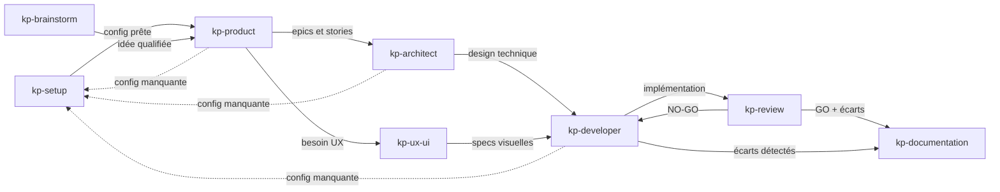

# kp-agents — Instructions pour Claude

## Principe fondamental

Ce projet est un **catalogue d'agents IA distribué sur 3 outils**.
Il n'y a **plus de génération ni de templating** : chaque outil a son dossier dédié, au format qu'il attend directement. Le contenu de chaque agent est **écrit à plat et dupliqué** dans les 3 dossiers.

```
claude/   ← plugin Claude Code : subagents (agents/) + skills (skills/)
codex/    ← skills Codex
cursor/   ← règles Cursor (.mdc)
```

**Modèle agents / skills (côté Claude)** : chaque rôle est un **subagent** (`claude/agents/kp-<role>.md`) qui porte le **contexte + la méthode + les bonnes pratiques** et **délègue les actions** à des **skills** dédiées (`claude/skills/`) :
- **skills partagées** (dé-duplication des blocs jadis copiés dans tous les agents) : `kp-sources-config`, `kp-docs-structure`, `kp-handoff`, `kp-doc-templates` ;
- **skills spécifiques** : procédures `kp-test-*` (7), `kp-setup-*` (8), `kp-doc-index`, `kp-uxui-dev-specs`.

⚠️ **Transitoire** : ce découpage agents/skills n'est appliqué que sur `claude/` pour l'instant. `codex/` et `cursor/` restent des skills / règles **monolithiques par rôle** jusqu'à une passe de réplication ultérieure.

Modifier un rôle = éditer son **agent** + ses **skills** côté `claude/`, **et** ses équivalents `codex/` / `cursor/`. Pas de source unique, pas de `sync.sh` qui régénère : `sync.sh` se contente d'**installer** Cursor et Codex sur la machine locale.

## Distribution

- **Claude Code** → plugin marketplace (`claude/`, commité dans git). Le catalogue racine `.claude-plugin/marketplace.json` pointe sur `./` (le repo entier est le plugin). Installation utilisateur :
  `/plugin marketplace add KeyProd/kp-agents` + `/plugin install kp-agents@kp-agents`.
  Invocation : les **subagents** s'auto-délèguent (sur leur `description`) ou s'adressent via `@agent-kp-agents:kp-<role>` ; les **skills** restent invocables `/kp-agents:<skill>` (mais sont surtout appelées par les agents via l'outil `Skill`).
  Claude Code n'est **pas** installé localement par `sync.sh` — il passe par le marketplace git.
- **Cursor** → règles copiées par `sync.sh` dans `~/.cursor/rules/kp-*.mdc`
- **Codex** → skills copiées par `sync.sh` dans `~/.codex/skills/kp-*/`

## Structure du projet

```
.claude-plugin/
  marketplace.json   ← Catalogue marketplace (source: ./ → le repo entier est le plugin)
  plugin.json        ← Manifeste plugin : name, version (manuelle), agents[] (liste de fichiers) + skills[] → ./claude
claude/              ← Contenu du plugin Claude Code (référencé par plugin.json)
  agents/kp-<role>.md          ← Subagent : contexte + méthode + bonnes pratiques (10)
  skills/kp-<skill>/           ← Skill d'action ou partagée (22)
    SKILL.md         ← frontmatter name + description, puis la procédure
    references/*.md   ← Templates / gabarits lourds, chargés à la demande (progressive disclosure)
codex/               ← Skills Codex (monolithiques par rôle — réplication agents/skills à venir)
  kp-<nom>/
    SKILL.md         ← Skill (frontmatter name + description + metadata)
    agents/openai.yaml   ← Interface Codex (display_name, default_prompt, policy)
cursor/              ← Règles Cursor
  kp-<nom>.mdc       ← Règle (frontmatter description + alwaysApply)
sync.sh              ← Installe cursor/ → ~/.cursor/rules et codex/ → ~/.codex/skills (macOS)
.githooks/pre-commit ← Vérifie le bump de version quand un skill change
docs/                ← Documentation projet (vision, architecture, epics, stories)
.kp-agents.yml          ← OPTIONNEL — politique de sources du projet (commité)
.kp-agents.local.yml    ← OPTIONNEL — chemins machine-spécifiques (gitignoré)
```

## Règles critiques

- **Toute modification d'agent doit être répliquée dans les 3 dossiers** (`claude/`, `codex/`, `cursor/`). Le contenu est dupliqué par design — il n'y a pas de mécanisme qui propage un changement d'un dossier à l'autre.
- **Respecter le format propre à chaque cible** (voir « Format par cible » ci-dessous). Ne pas copier-coller un `.mdc` Cursor dans `claude/` ou inversement : les frontmatters diffèrent.
- **La version est unique et manuelle** : `.claude-plugin/plugin.json` → champ `version`. C'est la version de référence pour les 3 cibles. La monter à la main dès qu'un skill change (le hook de pré-commit le rappelle).
- **`sync.sh` ne génère plus rien** — il copie `cursor/` et `codex/` vers `~/.cursor` / `~/.codex`. Ne pas y remettre de logique de templating ou de bump.
- Préfixe `kp-` **obligatoire** dans le nom de fichier ET dans le frontmatter `name:` (unicité du skill sur les 3 cibles, pas de collision avec d'autres plugins).

## Format par cible

### Claude — subagents (`claude/agents/kp-<role>.md`)
- Frontmatter `name` (= `kp-<role>`), `description` (signaux de déclenchement → pilote l'auto-délégation), `color`, `tools` optionnel (omis = hérite tout, dont l'outil `Skill`).
- Body = system prompt : persona + rôle + méthode/process + règles dures + frontières + gotchas + une section **« Compétences (skills) »** listant les skills à charger à la demande.
- L'agent ne duplique pas les blocs partagés : il **pointe** vers `kp-sources-config`, `kp-docs-structure`, `kp-handoff`, `kp-doc-templates` et ses skills spécifiques.

### Claude — skills (`claude/skills/kp-<skill>/`)
- `SKILL.md` — frontmatter `name` + `description` (orientée déclenchement / usage), puis la procédure.
- `references/*.md` — gabarits/templates lourds chargés à la demande (`Read`).
- **Partagées** : `kp-sources-config`, `kp-docs-structure`, `kp-handoff`, `kp-doc-templates`. **Spécifiques** : `kp-test-*`, `kp-setup-*`, `kp-doc-index`, `kp-uxui-dev-specs`.

### Codex (`codex/kp-<nom>/`)
- `SKILL.md` — frontmatter `name`, `description`, `metadata.short-description`, puis le corps inliné (pas de sous-dossier `references/` : tout est dans le SKILL.md).
- `agents/openai.yaml` — `interface` (`display_name`, `short_description`, `default_prompt`) + `policy.allow_implicit_invocation`.

### Cursor (`cursor/kp-<nom>.mdc`)
- Frontmatter `description` + `alwaysApply: false`, puis le corps inliné.

## Ajouter ou modifier un agent

1. Côté **Claude** : éditer le **subagent** (`claude/agents/kp-<role>.md`, contexte + méthode) et/ou la **skill** concernée (`claude/skills/kp-<skill>/`, l'action). Garder les agents fins : toute procédure réutilisable va dans une skill. **Nouvel agent** → ajouter son fichier à la liste `agents[]` de `.claude-plugin/plugin.json` (ce champ liste les fichiers, pas un dossier).
2. Côté **Codex / Cursor** : répliquer le changement dans `codex/kp-<nom>/` et `cursor/kp-<nom>.mdc` (encore monolithiques par rôle). Pour un **nouvel** agent Codex : créer aussi `codex/kp-<nom>/agents/openai.yaml`.
3. **Monter la version** dans `.claude-plugin/plugin.json` (patch pour un correctif, minor pour un ajout d'agent / une feature, major pour une rupture). Mettre à jour `CHANGELOG.md`.
4. Lancer `./sync.sh` pour installer Cursor + Codex en local (macOS).
5. Publier : `git add` + commit (le hook de pré-commit vérifie le bump) + tag `kp-agents-v<X.Y.Z>` + push. Les utilisateurs Claude reçoivent la maj au prochain `/plugin marketplace update`.

## sync.sh

```
./sync.sh            # installe cursor/ → ~/.cursor/rules et codex/ → ~/.codex/skills + câble le hook
./sync.sh --clean    # supprime les kp-* installés (~/.cursor/rules, ~/.codex/skills) puis sort
./sync.sh -h         # aide
```

`sync.sh` câble aussi `core.hooksPath .githooks` (idempotent) pour activer le hook de pré-commit.

## Versioning & hook de pré-commit

- **Versioning manuel** : aucun bump automatique. La version vit dans `.claude-plugin/plugin.json`.
- **`.githooks/pre-commit`** : si un commit modifie un agent ou un skill (`claude/agents/`, `claude/skills/`, `codex/`, `cursor/`) **sans** que `version` ait changé vs `HEAD`, le commit est **bloqué**. Les commits qui ne touchent pas aux agents/skills (docs, `sync.sh`…) passent librement.
- Activation : `git config core.hooksPath .githooks` (fait automatiquement par `sync.sh`).
- Contournement ponctuel : `git commit --no-verify`.

## Workflow inter-agents

Côté Claude, chaque rôle est un subagent (`@agent-kp-agents:<nom>` ou auto-délégation). Le diagramme ci-dessous décrit le pipeline conceptuel (noms de rôle, indépendants de l'outil).



**Pipeline standard** : kp-brainstorm → kp-product → kp-architect → kp-developer → kp-review
**Agents transversaux** : kp-ux-ui (entre kp-product et kp-developer), kp-documentation (après kp-review ou kp-developer), kp-setup (auto-redirect depuis tout agent détectant une config manquante), kp-test (tests E2E pilotés par référentiel de cas, après kp-developer)
**Agents standalone** : kp-daily (hors pipeline — synthèse quotidienne sessions Claude / Outlook / Teams)
**Relais** : chaque agent produit un bloc de handoff structuré pour transmettre le contexte au suivant

## Agents disponibles

Convention de nommage : tous les rôles portent le préfixe `kp-` dès le frontmatter `name:`. Côté Claude Code, ce sont désormais des **subagents** : auto-délégation sur la `description`, ou adressage explicite `@agent-kp-agents:kp-<role>`.

| Agent | Invocation Claude | Rôle |
|-------|-------------------|------|
| kp-brainstorm | `@agent-kp-agents:kp-brainstorm` | Explorer des idées, challenger des hypothèses |
| kp-product | `@agent-kp-agents:kp-product` | Structurer en roadmap, epics et stories |
| kp-architect | `@agent-kp-agents:kp-architect` | Concevoir l'architecture technique |
| kp-developer | `@agent-kp-agents:kp-developer` | Implémenter les stories et epics |
| kp-review | `@agent-kp-agents:kp-review` | Relire, tester, valider le code |
| kp-documentation | `@agent-kp-agents:kp-documentation` | Analyser et maintenir la documentation |
| kp-ux-ui | `@agent-kp-agents:kp-ux-ui` | Designer UX/UI et identité visuelle |
| kp-setup | `@agent-kp-agents:kp-setup` | Configurer les sources du projet (git, project, documentation, testing) |
| kp-daily | `@agent-kp-agents:kp-daily` | Daily synthétique en français (sessions Claude J-1, Outlook, Teams) |
| kp-test | `@agent-kp-agents:kp-test` | Orchestrer les tests E2E (cas Xray + test code + remontée) |

Pour Cursor : `@kp-<nom>` via le sélecteur de règles. Pour Codex : skill auto-détectée `kp-<nom>`. (Codex/Cursor restent monolithiques par rôle — réplication du modèle agents/skills à venir.)
