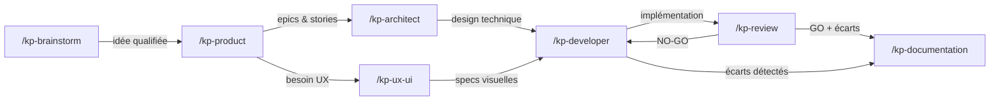

# kp-agents — Instructions pour Claude

## Principe fondamental

Ce projet est un **système de distribution multi-cibles** pour des agents IA.
La source de vérité unique est le dossier `agents/`. Le dossier `dist/` est **entièrement généré** par `sync.sh` — ne jamais y écrire manuellement.

## Structure du projet

```
agents/            ← Source de vérité. Un fichier .md par agent.
includes/          ← Templates réutilisables, injectés via {{include:nom}}
dist/              ← GÉNÉRÉ. Ne jamais modifier directement.
  claude/          ← Commandes Claude Code (kp-*.md)
  cursor/          ← Règles Cursor (kp-*.mdc)
  codex/           ← Skills Codex (kp-*/SKILL.md + agents/openai.yaml)
sync.sh            ← Script de synchronisation agents/ → dist/
.installed-agents  ← Manifeste local (non versionné) : liste des agents installés au dernier sync
```

## Ajouter ou modifier un agent

1. Créer ou modifier le fichier dans `agents/<nom>.md`
2. Respecter le frontmatter obligatoire :
   ```yaml
   ---
   name: <nom>
   description: "<description longue>"
   short_description: "<description courte>"
   default_prompt: "<prompt par défaut>"
   ---
   ```
3. Lancer `./sync.sh` (ou `./sync.sh --dist-only` pour générer sans installer)
4. Le script préfixe automatiquement tous les noms avec `kp-` → un agent `review` devient `/kp-review`

### Flags disponibles

| Flag | Effet |
|------|-------|
| `--dist-only` | Génère dans `dist/` sans installer dans `~/.claude`, `~/.cursor`, `~/.codex` |
| `--clean` | Supprime les agents listés dans `.installed-agents` (nettoyage chirurgical) puis sort |
| `--clean-all` | Supprime tous les `kp-*` via glob dans `dist/` et les 3 cibles puis sort |

## Règles critiques

- **Ne jamais écrire dans `dist/`** — c'est un dossier généré, tout sera écrasé au prochain sync
- **Ne jamais modifier les fichiers dans `~/.claude/commands/`, `~/.cursor/rules/`, `~/.codex/skills/`** — ils sont installés par sync.sh
- **Toujours passer par `agents/`** pour toute modification d'agent
- Nettoyage automatique au début de chaque sync : utilise `.installed-agents` pour supprimer chirurgicalement les agents du run précédent (permet de supprimer proprement un agent retiré de `agents/`). Fallback sur glob `kp-*` si le manifeste est absent.

## Includes

Les agents peuvent inclure des templates partagés avec la directive `{{include:nom}}` :
- `docs-structure` — Convention de structure documentaire projet (complète, avec tous les templates)
- `docs-structure-light` — Convention de structure documentaire (arborescence et règles uniquement, sans templates)
- `guardrails` — Garde-fous anti-hallucination transversaux
- `handoff` — Convention de relais inter-agents (bloc de contexte structuré)
- `product-template` — Template pour docs/product.md
- `architect-template` — Template pour docs/architect.md
- `epic-template` — Template pour les epics
- `story-template` — Template pour les stories

### Stratégie d'inclusion par agent
- **product, developer, review** : `docs-structure` (complet — ces agents créent/modifient stories et epics)
- **architect** : `docs-structure-light` + `architect-template` (n'a besoin que du template architecture)
- **brainstorm, documentation, ux-ui** : `docs-structure-light` (n'ont pas besoin des templates détaillés)

## Workflow inter-agents



**Pipeline standard** : brainstorm → product → architect → developer → review
**Agents transversaux** : ux-ui (entre product et developer), documentation (après review ou developer)
**Relais** : chaque agent produit un bloc de handoff structuré pour transmettre le contexte au suivant

## Agents disponibles

### Agents génériques (workflow développement)
| Agent | Fichier | Rôle |
|-------|---------|------|
| brainstorm | `agents/brainstorm.md` | Explorer des idées, challenger des hypothèses |
| product | `agents/product.md` | Structurer en roadmap, epics et stories |
| architect | `agents/architect.md` | Concevoir l'architecture technique |
| developer | `agents/developer.md` | Implémenter les stories et epics |
| review | `agents/review.md` | Relire, tester, valider le code |
| documentation | `agents/documentation.md` | Analyser et maintenir la documentation |
| ux-ui | `agents/ux-ui.md` | Designer UX/UI et identité visuelle |

### Agents RecetteMoi (workflow tickets support)
| Agent | Fichier | Rôle |
|-------|---------|------|
| recettemoi-support | `agents/recettemoi-support.md` | Porte d'entrée : triage et recommandation de tickets |
| recettemoi-dev | `agents/recettemoi-dev.md` | Traitement technique (BUG/IMPROVEMENT) |
| recettemoi-review | `agents/recettemoi-review.md` | Validation et réponse utilisateur |
