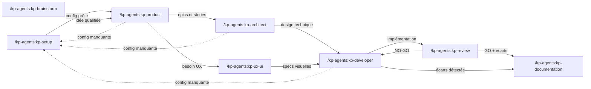

# kp-agents — Instructions pour Claude

## Principe fondamental

Ce projet est un **catalogue d'agents IA distribué sur 3 outils**.
Il n'y a **plus de génération ni de templating** : chaque outil a son dossier dédié, au format qu'il attend directement. Le contenu de chaque agent est **écrit à plat et dupliqué** dans les 3 dossiers.

```
claude/   ← plugin Claude Code : skills uniquement (skills/)
codex/    ← skills Codex
cursor/   ← règles Cursor (.mdc)
```

**Modèle 100 % skills (côté Claude)** : il n'y a **pas de subagent**. Chaque rôle est une **skill** (`claude/skills/kp-<role>/SKILL.md`), invocable `/kp-agents:kp-<role>`, qui porte la persona, la méthode et le routage. Deux mécanismes de délégation, et un seul critère pour choisir :

| Contenu | Où il vit | Comment on le charge |
|---|---|---|
| **Transverse à plusieurs rôles** | skill partagée `claude/skills/kp-<nom>/` | outil `Skill` |
| **Propre à un seul rôle** | `claude/skills/kp-<role>/references/<proc>.md` | `Read`, à la demande |

Les 5 skills partagées : `kp-sources-config`, `kp-docs-structure`, `kp-handoff`, `kp-doc-templates`, `kp-validation-criteres` (developer ↔ review). Tout le reste (procédures `setup-*`, `kp-test-*`, `doc-index-management`, `uxui-dev-specs`, gabarits) vit dans les `references/` du rôle qui s'en sert.

⚠️ **Asymétrie assumée** : ce découpage skill de rôle + `references/` n'existe que côté `claude/`. `codex/` et `cursor/` n'ont pas de mécanisme de sous-fichiers → leur contenu est **entièrement inliné, monolithique par rôle**.

Modifier un rôle = éditer sa **skill** côté `claude/`, **et** ses équivalents `codex/` / `cursor/`. Pas de source unique, pas de `sync.sh` qui régénère : `sync.sh` se contente d'**installer** Cursor et Codex sur la machine locale.

## Distribution

- **Claude Code** → plugin marketplace (`claude/`, commité dans git). Le catalogue racine `.claude-plugin/marketplace.json` pointe sur `./` (le repo entier est le plugin). Installation utilisateur :
  `/plugin marketplace add KeyProd/kp-agents` + `/plugin install kp-agents@kp-agents`.
  Invocation : `/kp-agents:kp-<role>` pour les rôles ; les skills partagées sont surtout chargées par les rôles via l'outil `Skill`, mais restent invocables directement.
  Claude Code n'est **pas** installé localement par `sync.sh` — il passe par le marketplace git.
- **Cursor** → règles copiées par `sync.sh` dans `~/.cursor/rules/kp-*.mdc`
- **Codex** → skills copiées par `sync.sh` dans `~/.codex/skills/kp-*/`
- **Plugin `jpb-platform`** (second plugin de la marketplace) → dossier `jpb-platform/`, source `./jpb-platform` dans `marketplace.json`, version propre (`jpb-platform/.claude-plugin/plugin.json`, tags `jpb-platform-v<X.Y.Z>`). Skills Claude dans `jpb-platform/skills/` (invocation `/jpb-platform:<nom>`), variantes Codex dans `jpb-platform/codex/jpb-*` (copiées par `sync.sh`), pas de variante Cursor à ce jour. Plugin **mince** : le dépôt étant public, ses skills ne portent que la démarche et lisent les règles dans le dépôt privé `KeyProd/jpb-platform` (`jpb-platform/scripts/jpb-platform-ref.sh`). Une règle de la plateforme se modifie là-bas, pas ici. Pas de préfixe `kp-` : côté Claude, l'espace de noms `jpb-platform:` assure l'unicité ; côté Codex, le préfixe `jpb-`.

## Structure du projet

```
.claude-plugin/
  marketplace.json   ← Catalogue marketplace (source: ./ → le repo entier est le plugin)
  plugin.json        ← Manifeste plugin : name, version (manuelle), skills[] → ./claude/skills/
claude/              ← Contenu du plugin Claude Code (référencé par plugin.json)
  skills/
    kp-<role>/       ← Skill de rôle (10) : kp-architect, kp-brainstorm, kp-daily, kp-developer,
      SKILL.md       ←   kp-documentation, kp-product, kp-review, kp-setup, kp-test, kp-ux-ui
      references/*.md  ← Procédures et gabarits propres au rôle, lus à la demande
    kp-<partagée>/   ← Skill partagée (5) : kp-sources-config, kp-docs-structure, kp-handoff,
      SKILL.md       ←   kp-doc-templates, kp-validation-criteres
      references/*.md
codex/               ← Skills Codex (monolithiques par rôle, tout inliné)
  kp-<nom>/
    SKILL.md         ← Skill (frontmatter name + description + metadata)
    agents/openai.yaml   ← Interface Codex (display_name, default_prompt, policy)
cursor/              ← Règles Cursor
  kp-<nom>.mdc       ← Règle (frontmatter description + alwaysApply), tout inliné
sync.sh              ← Installe cursor/ → ~/.cursor/rules et codex/ → ~/.codex/skills (macOS)
.githooks/pre-commit ← Vérifie le bump de version quand un skill change
docs/                ← Documentation projet (vision, architecture, epics, stories)
.kp-context.yml      ← OPTIONNEL — carte de contexte du projet
```

## Règles critiques

- **Toute modification d'agent doit être répliquée dans les 3 dossiers** (`claude/`, `codex/`, `cursor/`). Le contenu est dupliqué par design — il n'y a pas de mécanisme qui propage un changement d'un dossier à l'autre.
- **Respecter le format propre à chaque cible** (voir « Format par cible » ci-dessous). Ne pas copier-coller un `.mdc` Cursor dans `claude/` ou inversement : les frontmatters diffèrent.
- **Pas de subagent** : ne jamais recréer `claude/agents/` ni de champ `agents[]` dans `plugin.json`. Un rôle est une skill, point.
- **La version est unique et manuelle** : `.claude-plugin/plugin.json` → champ `version`. C'est la version de référence pour les 3 cibles. La monter à la main dès qu'un skill change (le hook de pré-commit le rappelle).
- **`sync.sh` ne génère plus rien** — il copie `cursor/` et `codex/` vers `~/.cursor` / `~/.codex`. Ne pas y remettre de logique de templating ou de bump.
- Préfixe `kp-` **obligatoire** dans le nom de dossier ET dans le frontmatter `name:` (unicité du skill sur les 3 cibles, pas de collision avec d'autres plugins).

## Format par cible

### Claude — skills de rôle (`claude/skills/kp-<role>/`)
- `SKILL.md` — frontmatter `name` (= `kp-<role>`) + `description` orientée **déclenchement** (« Utilise ce skill quand… », déclencheurs, périmètre exclu). C'est cette description que Claude lit pour proposer la skill — elle doit rester riche.
- Body = persona + rôle + méthode/process + règles dures + frontières + gotchas + une section **« Compétences »** qui liste les skills partagées (outil `Skill`) et les procédures locales (`references/`).
- `references/*.md` — procédures et gabarits propres au rôle, chargés à la demande via `Read`. Markdown nu, pas de frontmatter.

### Claude — skills partagées (`claude/skills/kp-<nom>/`)
- Même format, mais `description` orientée **usage par un autre skill** (« À charger avant d'écrire un document… »).
- Un contenu passe en skill partagée **dès qu'un 2ᵉ rôle en a besoin** ; tant qu'il ne sert qu'à un rôle, il reste dans ses `references/`.

### Codex (`codex/kp-<nom>/`)
- `SKILL.md` — frontmatter `name`, `description`, `metadata.short-description`, puis le corps **entièrement inliné** (pas de sous-dossier `references/`).
- `agents/openai.yaml` — `interface` (`display_name`, `short_description`, `default_prompt`) + `policy.allow_implicit_invocation`.

### Cursor (`cursor/kp-<nom>.mdc`)
- Frontmatter `description` + `alwaysApply: false`, puis le corps **entièrement inliné**.

### Convention d'inlining (Codex et Cursor)

Ces deux cibles sont des **fichiers uniques** : ni skill partagée, ni `references/`. Le contenu que Claude charge à la demande y est rassemblé en fin de fichier, sous un titre `# Annexes`, **un bloc `## Annexe — <nom>` par skill partagée ou procédure**, chacun présent **une seule fois**.

Dans le corps, les renvois prennent la forme `annexe « <nom> »` :

| Côté Claude | Côté Codex / Cursor |
|---|---|
| charge la skill `kp-doc-templates` | voir l'annexe « kp-doc-templates » |
| lis `references/setup-git.md` | voir l'annexe « setup-git » |
| une skill partagée **non** inlinée dans ce rôle | reformulée en clair (« les gabarits de documents structurants ») |

⚠️ **Ne jamais coller un bloc au milieu d'une phrase ou d'une cellule de tableau** — c'est ce que faisait l'ancienne génération par substitution textuelle, qui cassait les tableaux et dupliquait le même gabarit jusqu'à 3× par fichier. Le corps renvoie, l'annexe contient.

## Ajouter ou modifier un agent

1. Côté **Claude** : éditer la **skill de rôle** (`claude/skills/kp-<role>/SKILL.md`) et/ou la procédure concernée (`references/<proc>.md`). Garder le `SKILL.md` lisible : une procédure qui grossit part en `references/`. Si elle devient utile à un 2ᵉ rôle, la promouvoir en skill partagée.
2. Côté **Codex / Cursor** : répliquer le changement dans `codex/kp-<nom>/SKILL.md` et `cursor/kp-<nom>.mdc`, **en inlinant** ce qui est en `references/` côté Claude. Pour un **nouvel** agent Codex : créer aussi `codex/kp-<nom>/agents/openai.yaml`.
3. **Monter la version** dans `.claude-plugin/plugin.json` (patch pour un correctif, minor pour un ajout d'agent / une feature, major pour une rupture). Mettre à jour `CHANGELOG.md`.
4. Lancer `./sync.sh` pour installer Cursor + Codex en local (macOS).
5. Publier : `git add` + commit (le hook de pré-commit vérifie le bump) + tag `kp-agents-v<X.Y.Z>` + push. Les utilisateurs Claude reçoivent la maj au prochain `/plugin marketplace update`.

**Anti-pattern** : ne **pas** fragmenter un rôle en plusieurs slash commands (`/kp-agents:kp-setup-git`, `/kp-agents:kp-setup-tickets`…). Un rôle reste UNE entité avec UNE persona — la décomposition en `references/` est interne, invisible pour l'utilisateur.

## sync.sh

```
./sync.sh            # installe cursor/ → ~/.cursor/rules et codex/ → ~/.codex/skills + câble le hook
./sync.sh --clean    # supprime les kp-* installés (~/.cursor/rules, ~/.codex/skills) puis sort
./sync.sh -h         # aide
```

`sync.sh` câble aussi `core.hooksPath .githooks` (idempotent) pour activer le hook de pré-commit.

## Versioning & hook de pré-commit

- **Versioning manuel** : aucun bump automatique. La version vit dans `.claude-plugin/plugin.json`.
- **`.githooks/pre-commit`** : si un commit modifie un skill (`claude/skills/`, `codex/`, `cursor/`) **sans** que `version` ait changé vs `HEAD`, le commit est **bloqué**. Les commits qui ne touchent pas aux skills (docs, `sync.sh`…) passent librement.
- Activation : `git config core.hooksPath .githooks` (fait automatiquement par `sync.sh`).
- Contournement ponctuel : `git commit --no-verify`.

## Workflow inter-agents



**Pipeline standard** : kp-brainstorm → kp-product → kp-architect → kp-developer → kp-review
**Agents transversaux** : kp-ux-ui (entre kp-product et kp-developer), kp-documentation (après kp-review ou kp-developer), kp-setup (auto-redirect depuis tout agent détectant une config manquante), kp-test (tests E2E pilotés par référentiel de cas, après kp-developer)
**Agents standalone** : kp-daily (hors pipeline — synthèse quotidienne sessions Claude / Outlook / Teams)
**Relais** : chaque agent produit un bloc de handoff structuré (skill `kp-handoff`) pour transmettre le contexte au suivant

## Agents disponibles

Convention de nommage : tous les rôles portent le préfixe `kp-` dès le frontmatter `name:`. Côté Claude Code, le namespace de plugin (`kp-agents:`) se préfixe devant le nom du skill → `/kp-agents:kp-architect`.

| Agent | Skill Claude | Invocation Claude | Rôle |
|-------|--------------|-------------------|------|
| kp-brainstorm | `claude/skills/kp-brainstorm/` | `/kp-agents:kp-brainstorm` | Explorer des idées, challenger des hypothèses |
| kp-product | `claude/skills/kp-product/` | `/kp-agents:kp-product` | Structurer en roadmap, epics et stories |
| kp-architect | `claude/skills/kp-architect/` | `/kp-agents:kp-architect` | Concevoir l'architecture technique |
| kp-developer | `claude/skills/kp-developer/` | `/kp-agents:kp-developer` | Implémenter les stories et epics |
| kp-review | `claude/skills/kp-review/` | `/kp-agents:kp-review` | Relire, tester, valider le code |
| kp-documentation | `claude/skills/kp-documentation/` | `/kp-agents:kp-documentation` | Analyser et maintenir la documentation |
| kp-ux-ui | `claude/skills/kp-ux-ui/` | `/kp-agents:kp-ux-ui` | Designer UX/UI et identité visuelle |
| kp-setup | `claude/skills/kp-setup/` | `/kp-agents:kp-setup` | Configurer les sources du projet (git, project, documentation, testing) |
| kp-daily | `claude/skills/kp-daily/` | `/kp-agents:kp-daily` | Daily synthétique en français (sessions Claude J-1, Outlook, Teams) |
| kp-test | `claude/skills/kp-test/` | `/kp-agents:kp-test` | Orchestrer les tests E2E (cas Xray + test code + remontée) |

Skills partagées : `kp-sources-config`, `kp-docs-structure`, `kp-handoff`, `kp-doc-templates`, `kp-validation-criteres`.

Pour Cursor : `@kp-<nom>` via le sélecteur de règles. Pour Codex : skill auto-détectée `kp-<nom>`. (Codex/Cursor restent monolithiques par rôle — les procédures y sont inlinées.)
