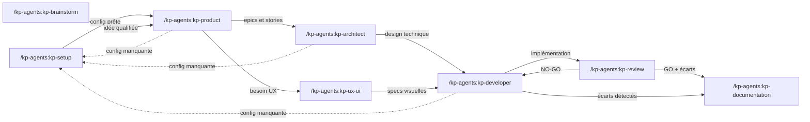

# kp-agents — Instructions pour Claude

## Principe fondamental

Ce projet est un **système de distribution multi-cibles** pour des agents IA.
La source de vérité unique est le dossier `agents/`. Les dossiers `plugins/kp-agents/skills/` et `dist/` sont **entièrement générés** par `sync.sh` — ne jamais y écrire manuellement.

## Distribution

- **Claude Code** → plugin marketplace (`plugins/kp-agents/`, commité dans git). Installation utilisateur via `/plugin marketplace add KeyProd/kp-agents` + `/plugin install kp-agents@kp-agents`. Invocation : `/kp-agents:<nom>`
- **Cursor** → règles importées localement par `sync.sh` (`~/.cursor/rules/kp-*.mdc`)
- **Codex** → skills importées localement par `sync.sh` (`~/.codex/skills/kp-*/`)

`sync.sh` **ne dépose plus rien dans `~/.claude/commands/`** — cette cible est gérée exclusivement par le plugin marketplace. Les résidus d'anciennes installations y sont automatiquement purgés au premier run.

## Structure du projet

```
agents/            ← Source de vérité. Un fichier .md par agent.
includes/          ← Templates réutilisables, injectés via {{include:nom}}
.claude-plugin/
  marketplace.json ← Catalogue marketplace Claude Code (statique)
plugins/           ← GÉNÉRÉ par sync.sh, COMMITÉ dans git
  kp-agents/
    .claude-plugin/plugin.json    ← Manifeste statique (name, version, description)
    skills/<nom>/SKILL.md         ← Skills générés par sync.sh
dist/              ← GÉNÉRÉ. NON commité (.gitignore)
  cursor/          ← Règles Cursor (kp-*.mdc)
  codex/           ← Skills Codex (kp-*/SKILL.md + agents/openai.yaml)
sync.sh            ← Script de synchronisation agents/ → plugins/ + dist/
.installed-agents  ← Manifeste local (non versionné) : liste des agents installés au dernier sync
.kp-agents.yml         ← OPTIONNEL — politique de sources du projet (commité)
.kp-agents.local.yml   ← OPTIONNEL — chemins machine-spécifiques (gitignoré)
docs/              ← Documentation projet (vision, architecture, epics, stories)
```

## Ajouter ou modifier un agent

1. Créer ou modifier le fichier dans `agents/kp-<nom>.md` — le préfixe `kp-` est **obligatoire** dans le nom de fichier ET dans le frontmatter `name:` (convention v2.0.0, assure l'unicité du skill sur les 3 cibles)
2. Respecter le frontmatter obligatoire :
   ```yaml
   ---
   name: kp-<nom>
   description: "<description longue>"
   short_description: "<description courte>"
   default_prompt: "<prompt par défaut>"
   ---
   ```
3. Lancer `./sync.sh` (ou `./sync.sh --dist-only` pour générer sans installer Cursor/Codex)
4. Le script génère le SKILL.md dans `plugins/kp-agents/skills/kp-<nom>/` et les artefacts Cursor (`kp-<nom>.mdc`) / Codex (`kp-<nom>/SKILL.md`). Aucun double-préfixage : `sync.sh` utilise directement le `name:` du frontmatter, qui doit déjà inclure `kp-`.
5. Publier la mise à jour Claude :
   - `sync.sh` **bumpe automatiquement la version patch** si le contenu des skills a changé (cf. `_contentHash` + `_lastAutoVersion` dans `plugin.json` — géré par le script, ne pas modifier à la main)
   - Pour un bump mineur ou majeur (ajout/retrait d'agent, rupture), utiliser `./sync.sh --minor` ou `./sync.sh --major`
   - `git add agents/ plugins/` puis commit, tag `kp-agents-v<X.Y.Z>` et push
   - Les utilisateurs reçoivent la maj au prochain `/plugin marketplace update`

### Flags disponibles

| Flag | Effet |
|------|-------|
| `--dist-only` | Génère dans `plugins/` et `dist/` sans installer dans `~/.cursor` et `~/.codex` |
| `--clean` | Supprime les agents listés dans `.installed-agents` (plugin skills + Cursor + Codex) puis sort |
| `--clean-all` | Supprime tous les `kp-*` via glob (plugin skills + Cursor + Codex) puis sort |
| `--minor` | Force un bump mineur (`X.Y.Z` → `X.(Y+1).0`). À utiliser pour l'ajout d'un nouvel agent ou une feature significative. Exclusif avec `--major`, incompatible avec `--clean` / `--clean-all`. |
| `--major` | Force un bump majeur (`X.Y.Z` → `(X+1).0.0`). À utiliser pour une rupture (retrait d'agent, renommage de namespace). Exclusif avec `--minor`. |

Sans `--minor` ni `--major`, `sync.sh` **auto-bumpe le patch** si le contenu des skills a changé (SHA256 stocké dans `plugin.json._contentHash`). Un édit manuel de `version` dans `plugin.json` est **respecté** (comparaison avec `_lastAutoVersion`) — `sync.sh` n'écrase jamais un bump manuel.

## Règles critiques

- **Ne jamais écrire dans `plugins/kp-agents/skills/`** — c'est généré, tout sera écrasé au prochain sync. `plugins/kp-agents/.claude-plugin/plugin.json` est **statique** et bumpé à la main lors d'une release
- **Ne jamais écrire dans `dist/`** — c'est un dossier généré, tout sera écrasé au prochain sync
- **Ne jamais modifier les fichiers dans `~/.cursor/rules/` ou `~/.codex/skills/`** — ils sont installés par `sync.sh`
- **Toujours passer par `agents/`** pour toute modification d'agent
- Nettoyage automatique au début de chaque sync : utilise `.installed-agents` pour supprimer chirurgicalement les agents du run précédent (permet de supprimer proprement un agent retiré de `agents/`). Fallback sur glob `kp-*` si le manifeste est absent.
- Cleanup one-shot des résidus d'installations Claude locales antérieures (`dist/claude/` + `~/.claude/commands/kp-*.md`) au début de chaque `sync.sh` — idempotent
- **Configuration projet (`.kp-agents.yml` / `.kp-agents.local.yml`)** — depuis v1.1.0. **Seul l'agent `setup`** a le droit d'écrire ces fichiers. Les autres agents les lisent au démarrage et appliquent les règles de l'include `sources-config` (redirection chemin, fallback write, protocole d'erreur MCP). Absence de fichier = mode 100% local, comportement identique à v1.0.x.

## Includes et references

Deux directives de composition sont résolues par `sync.sh` avant écriture dans `plugins/` et `dist/` :

### `{{include:nom}}` — inline sur toutes les cibles
Pour le contenu transverse *léger* qui doit être présent immédiatement à l'activation du skill :
- `activation` — Rôle et persistance (2 lignes)
- `dependency-versions` — Règle « Versions des dépendances » (architect, developer, review)
- `docs-structure` — Convention de structure documentaire (complète, inclut les 4 {{ref}} de templates)
- `docs-structure-light` — Arborescence + règles, sans templates
- `handoff` — Convention de relais inter-agents
- `gotchas-transverses` — Gotchas communs aux 9 agents
- `sources-config` — Schéma `.kp-agents.yml`, règles de résolution de chemin, pipelines MCP pour tickets, préférences git (v1.1.0)

### `{{ref:nom}}` — reference file (progressive disclosure, agentskills.io)
Pour le contenu *lourd* ne servant que ponctuellement (templates de livrables) :
- **Claude plugin** : le fichier est copié dans `plugins/kp-agents/skills/<agent>/references/<nom>.md` et la directive est remplacée par un pointeur court. Claude Code charge le template **à la demande** via Read.
- **Cursor / Codex** : inline (ces cibles ne supportent pas la sous-arborescence → fallback behavior).

Refs disponibles :
- `product-template`, `architect-template`, `epic-template`, `story-template`, `index-template`

### Stratégie d'inclusion par agent
- Tous les agents : `{{include:docs-structure}}` (la light version a été supprimée — surcoût marginal)
- Templates lourds : `{{ref:}}` partout pour progressive disclosure

## Pattern « agent = orchestrateur + refs procédurales »

Quand un agent dépasse ~300 lignes générées **ou** a 3+ modes distincts, refactorer en :

```
plugins/kp-agents/skills/<agent>/
├── SKILL.md                  Persona + scope + router (≤ 250 lignes)
├── persona.md                Carte d'identité légère (auto-généré)
└── references/
    ├── <mode-A>.md           Procédure du mode A
    ├── <mode-B>.md           Procédure du mode B
    └── ...
```

Le `SKILL.md` contient :
- Persona, scope, anti-patterns globaux (gotchas transverses)
- Inputs/Outputs tables
- **Routing** : « selon la demande, charge `references/<mode>.md` »
- Cas limites globaux uniquement

Les refs (sources dans `includes/<agent>-<mode>.md`) contiennent :
- Questions à poser pour ce mode
- Outputs spécifiques
- Edge cases du mode
- Templates spécifiques

**Référence d'implémentation** : `setup` (8b26798) — orchestrateur 261 lignes + 4 refs (`setup-product`, `setup-tickets`, `setup-git`, `setup-global-doc`). Avant : 592 lignes monolithiques.

**Critères de refactor** :
| Signal | Action |
|--------|--------|
| > 350 lignes générées | Refactor recommandé |
| 3+ modes avec procédures distinctes | Refactor recommandé |
| Procédures dimension-spécifiques en cas limites volumineux | Extraire en refs |
| Une persona, plusieurs workflows | Orchestrateur + refs (pas plusieurs skills) |

**Anti-pattern** : ne **pas** fragmenter en plusieurs slash commands (`kp-agents:setup-product`, `kp-agents:setup-tickets`...). L'agent reste UNE entité avec UNE persona — la décomposition est interne, invisible pour l'utilisateur.

## Workflow inter-agents

Invocations via le plugin Claude Code : `/kp-agents:<nom>`.



**Pipeline standard** : kp-brainstorm → kp-product → kp-architect → kp-developer → kp-review
**Agents transversaux** : kp-ux-ui (entre kp-product et kp-developer), kp-documentation (après kp-review ou kp-developer), kp-setup (auto-redirect depuis tout agent détectant une config manquante), kp-test (tests E2E pilotés par référentiel de cas, après kp-developer)
**Agents standalone** : kp-daily (hors pipeline — synthèse quotidienne sessions Claude / Outlook / Teams)
**Relais** : chaque agent produit un bloc de handoff structuré pour transmettre le contexte au suivant

## Agents disponibles

Convention de nommage (v2.0.0) : tous les agents portent le préfixe `kp-` dès le frontmatter `name:`. Ce préfixe garantit l'unicité du skill côté Cursor / Codex et lève toute collision avec d'autres plugins. Côté Claude Code, le namespace de plugin (`kp-agents:`) reste préfixé devant le nom du skill → `/kp-agents:kp-brainstorm`.

| Agent | Fichier | Invocation Claude | Rôle |
|-------|---------|-------------------|------|
| kp-brainstorm | `agents/kp-brainstorm.md` | `/kp-agents:kp-brainstorm` | Explorer des idées, challenger des hypothèses |
| kp-product | `agents/kp-product.md` | `/kp-agents:kp-product` | Structurer en roadmap, epics et stories |
| kp-architect | `agents/kp-architect.md` | `/kp-agents:kp-architect` | Concevoir l'architecture technique |
| kp-developer | `agents/kp-developer.md` | `/kp-agents:kp-developer` | Implémenter les stories et epics |
| kp-review | `agents/kp-review.md` | `/kp-agents:kp-review` | Relire, tester, valider le code |
| kp-documentation | `agents/kp-documentation.md` | `/kp-agents:kp-documentation` | Analyser et maintenir la documentation |
| kp-ux-ui | `agents/kp-ux-ui.md` | `/kp-agents:kp-ux-ui` | Designer UX/UI et identité visuelle |
| kp-setup | `agents/kp-setup.md` | `/kp-agents:kp-setup` | Configurer les sources du projet (frontmatter `kp-agents:` des `docs/*.md` : git, project, documentation, testing) |
| kp-daily | `agents/kp-daily.md` | `/kp-agents:kp-daily` | Générer un daily synthétique en français (sessions Claude J-1, Outlook, Teams) |
| kp-test | `agents/kp-test.md` | `/kp-agents:kp-test` | Orchestrer les tests E2E (cas Xray + test code + remontée), garant de conformité de bout en bout |

Pour Cursor : `@kp-<nom>` via le sélecteur de règles (`@kp-brainstorm`, `@kp-daily`…).
Pour Codex : skill auto-détectée `kp-<nom>` (`kp-brainstorm`, `kp-daily`…).
