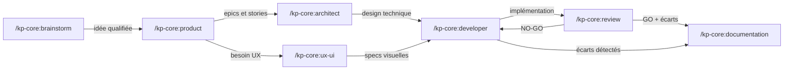

# kp-agents — Instructions pour Claude

## Principe fondamental

Ce projet est un **système de distribution multi-cibles** pour des agents IA.
La source de vérité unique est le dossier `agents/`. Les dossiers `plugins/kp-core/skills/` et `dist/` sont **entièrement générés** par `sync.sh` — ne jamais y écrire manuellement.

## Distribution

- **Claude Code** → plugin marketplace (`plugins/kp-core/`, commité dans git). Installation utilisateur via `/plugin marketplace add KeyProd/kp-agents` + `/plugin install kp-core@kp-agents`. Invocation : `/kp-core:<nom>`
- **Cursor** → règles importées localement par `sync.sh` (`~/.cursor/rules/kp-*.mdc`)
- **Codex** → skills importées localement par `sync.sh` (`~/.codex/skills/kp-*/`)

`sync.sh` **ne dépose plus rien dans `~/.claude/commands/`** — cette cible est gérée exclusivement par le plugin marketplace. Les résidus d'anciennes installations y sont automatiquement purgés au premier run.

## Structure du projet

```
agents/            ← Source de vérité. Un fichier .md par agent.
includes/          ← Templates réutilisables, injectés via {{include:nom}}
.claude-plugin/
  marketplace.json ← Catalogue marketplace Claude Code (statique)
plugins/           ← GÉNÉRÉ par sync.sh, COMMITÉ dans git
  kp-core/
    .claude-plugin/plugin.json    ← Manifeste statique (name, version, description)
    skills/<nom>/SKILL.md         ← Skills générés par sync.sh
dist/              ← GÉNÉRÉ. NON commité (.gitignore)
  cursor/          ← Règles Cursor (kp-*.mdc)
  codex/           ← Skills Codex (kp-*/SKILL.md + agents/openai.yaml)
sync.sh            ← Script de synchronisation agents/ → plugins/ + dist/
.installed-agents  ← Manifeste local (non versionné) : liste des agents installés au dernier sync
docs/              ← Documentation projet (vision, architecture, epics, stories)
```

## Ajouter ou modifier un agent

1. Créer ou modifier le fichier dans `agents/<nom>.md`
2. Respecter le frontmatter obligatoire :
   ```yaml
   ---
   name: <nom>
   description: "<description longue>"
   short_description: "<description courte>"
   default_prompt: "<prompt par défaut>"
   ---
   ```
3. Lancer `./sync.sh` (ou `./sync.sh --dist-only` pour générer sans installer Cursor/Codex)
4. Le script génère le SKILL.md dans `plugins/kp-core/skills/<nom>/` et les artefacts Cursor/Codex préfixés `kp-`
5. Publier la mise à jour Claude :
   - Bumper `plugins/kp-core/.claude-plugin/plugin.json` (semver)
   - `git add agents/ plugins/` puis commit, tag `kp-core-v<X.Y.Z>` et push
   - Les utilisateurs reçoivent la maj au prochain `/plugin marketplace update`

### Flags disponibles

| Flag | Effet |
|------|-------|
| `--dist-only` | Génère dans `plugins/` et `dist/` sans installer dans `~/.cursor` et `~/.codex` |
| `--clean` | Supprime les agents listés dans `.installed-agents` (plugin skills + Cursor + Codex) puis sort |
| `--clean-all` | Supprime tous les `kp-*` via glob (plugin skills + Cursor + Codex) puis sort |

## Règles critiques

- **Ne jamais écrire dans `plugins/kp-core/skills/`** — c'est généré, tout sera écrasé au prochain sync. `plugins/kp-core/.claude-plugin/plugin.json` est **statique** et bumpé à la main lors d'une release
- **Ne jamais écrire dans `dist/`** — c'est un dossier généré, tout sera écrasé au prochain sync
- **Ne jamais modifier les fichiers dans `~/.cursor/rules/` ou `~/.codex/skills/`** — ils sont installés par `sync.sh`
- **Toujours passer par `agents/`** pour toute modification d'agent
- Nettoyage automatique au début de chaque sync : utilise `.installed-agents` pour supprimer chirurgicalement les agents du run précédent (permet de supprimer proprement un agent retiré de `agents/`). Fallback sur glob `kp-*` si le manifeste est absent.
- Cleanup one-shot des résidus d'installations Claude locales antérieures (`dist/claude/` + `~/.claude/commands/kp-*.md`) au début de chaque `sync.sh` — idempotent

## Includes

Les agents peuvent inclure des templates partagés avec la directive `{{include:nom}}` :
- `docs-structure` — Convention de structure documentaire projet (complète, avec tous les templates)
- `docs-structure-light` — Convention de structure documentaire (arborescence et règles uniquement, sans templates)
- `guardrails` — Garde-fous anti-hallucination transversaux
- `handoff` — Convention de relais inter-agents (bloc de contexte structuré)
- `product-template` — Template pour docs/product.md
- `architect-template` — Template pour docs/architect.md
- `epic-template` — Template pour les epics
- `story-template` — Template pour les stories

### Stratégie d'inclusion par agent
- **product, developer, review** : `docs-structure` (complet — ces agents créent/modifient stories et epics)
- **architect** : `docs-structure-light` + `architect-template` (n'a besoin que du template architecture)
- **brainstorm, documentation, ux-ui** : `docs-structure-light` (n'ont pas besoin des templates détaillés)

Les directives `{{include:xxx}}` sont **résolues par `sync.sh`** avant écriture dans `plugins/` et `dist/`. Les artefacts générés contiennent du markdown final sans dépendances externes.

## Workflow inter-agents

Invocations via le plugin Claude Code : `/kp-core:<nom>`.



**Pipeline standard** : brainstorm → product → architect → developer → review
**Agents transversaux** : ux-ui (entre product et developer), documentation (après review ou developer)
**Relais** : chaque agent produit un bloc de handoff structuré pour transmettre le contexte au suivant

## Agents disponibles

| Agent | Fichier | Invocation Claude | Rôle |
|-------|---------|-------------------|------|
| brainstorm | `agents/brainstorm.md` | `/kp-core:brainstorm` | Explorer des idées, challenger des hypothèses |
| product | `agents/product.md` | `/kp-core:product` | Structurer en roadmap, epics et stories |
| architect | `agents/architect.md` | `/kp-core:architect` | Concevoir l'architecture technique |
| developer | `agents/developer.md` | `/kp-core:developer` | Implémenter les stories et epics |
| review | `agents/review.md` | `/kp-core:review` | Relire, tester, valider le code |
| documentation | `agents/documentation.md` | `/kp-core:documentation` | Analyser et maintenir la documentation |
| ux-ui | `agents/ux-ui.md` | `/kp-core:ux-ui` | Designer UX/UI et identité visuelle |

Pour Cursor : `@kp-<nom>` via le sélecteur de règles.
Pour Codex : skill auto-détectée `kp-<nom>`.
