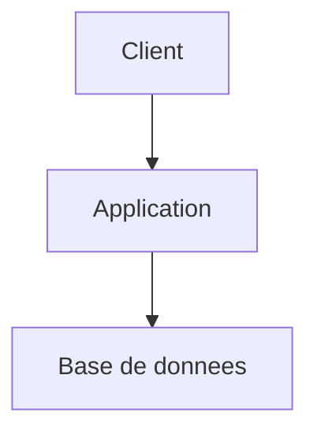

## Template recommandé - `docs/architect.md`

Objectif : document destiné aux développeurs, expliquant l'architecture réelle ou cible, les décisions techniques et les contraintes d'implémentation.

```markdown
---
title: Architecture Overview
date: YYYY-MM-DD
status: active
author: architect-agent
---

# Architecture - [Nom du projet]

## Résumé technique
[Vue d'ensemble courte de l'architecture, des principaux composants et du style global]

## Objectifs et contraintes
- [objectif technique]
- [contrainte technique]
- [contrainte non fonctionnelle]

## Architecture d'ensemble
- [composant / service]
- [composant / service]
- [flux ou dépendance structurante]

## Diagrammes
### Vue système


## Composants
### [Nom du composant]
- **Responsabilité** : [...]
- **Entrées / sorties** : [...]
- **Dépendances** : [...]
- **Source de vérité** : [...]

## Données et contrats
- [modèle ou entité clé]
- [contrat API ou événement important]
- [règle de cohérence des données]

## Décisions techniques
### ADR-001 - [Titre]
- **Statut** : proposed | accepted | deprecated
- **Contexte** : [...]
- **Décision** : [...]
- **Conséquences** : [...]
- **Alternatives rejetées** : [...]

## Sécurité, performance et opérations
- **Sécurité** : [...]
- **Performance / volumétrie** : [...]
- **Observabilité** : logs, métriques, alertes
- **Déploiement / rollback** : [...]

## Dette, risques et points à valider
- [risque / dette]
- [hypothèse technique à confirmer]

## Références
- [Product](product.md)
- [Roadmap](project/roadmap.md)
- [Feature docs](features/)
```

### Principes de rédaction
- Écrire pour des développeurs et reviewers techniques
- Documenter les frontières de responsabilité et les décisions
- Ne pas mélanger règles métier globales et détails purement produit
- Préférer le réel observé au design théorique si le code existe déjà
