# Guide des agents

> Description de chaque agent et visualisation de leurs workflows.
> Les traits pleins (`-->`) indiquent les chemins **obligatoires**. Les traits pointillés (`-.->`) indiquent les chemins **facultatifs**.

---

## Vue d'ensemble

Le projet comprend deux pipelines d'agents :

- **Pipeline développement** (7 agents) : workflow complet de l'idée au code validé
- **Pipeline RecetteMoi** (3 agents) : gestion des tickets de support utilisateur

---

## Pipeline développement — Vue globale

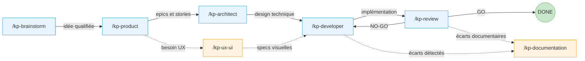

**Chemin obligatoire** : brainstorm --> product --> architect --> developer --> review
**Agents transversaux** (facultatifs) : ux-ui (entre product et developer), documentation (après review ou developer)

---

## Pipeline RecetteMoi — Vue globale

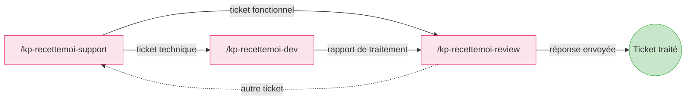

**Chemin obligatoire** : toujours commencer par support, puis dev (technique) ou review (fonctionnel)
**Retour facultatif** : review peut relancer support pour un nouveau ticket

---

## Agents génériques — Détail

---

### 1. Brainstorm (`/kp-brainstorm`)

**Rôle** : facilitateur de brainstorming. Explore une idée sous tous ses angles, propose des approches créatives et structure la réflexion pour la faire avancer concrètement.

**Sortie** : fichier `docs/ideas/<thème>.md` mis à jour progressivement.

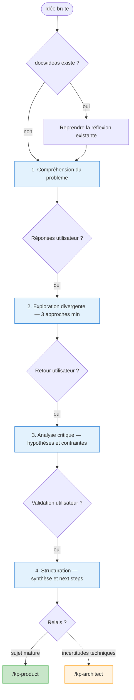

---

### 2. Product (`/kp-product`)

**Rôle** : Product Manager. Transforme des idées brutes en spécifications produit actionnables : vision, roadmap, epics et stories avec critères d'acceptation.

**Sortie** : `docs/product.md`, `docs/project/roadmap.md`, epics et stories dans `docs/project/epics/`.

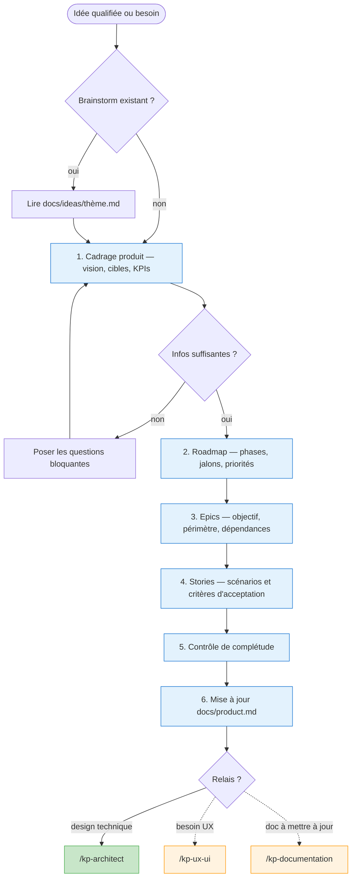

---

### 3. Architect (`/kp-architect`)

**Rôle** : Architecte logiciel senior. Conçoit des solutions techniques solides, évalue les compromis et documente les décisions d'architecture (ADR).

**Modes** : libre (réflexion technique sans epic) ou epic (conception liée à une epic produit).

**Sortie** : `docs/architect.md`, `docs/features/<group>/architect.md`, ADR.

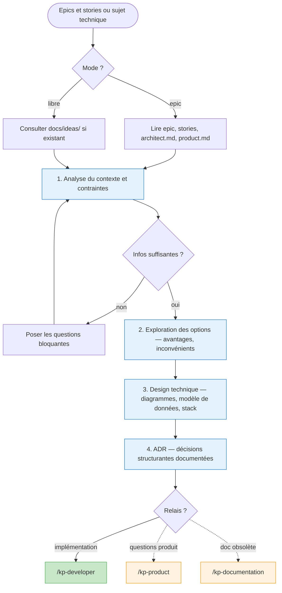

---

### 4. Developer (`/kp-developer`)

**Rôle** : Développeur senior. Implémente les fonctionnalités en suivant rigoureusement les spécifications produit et techniques documentées.

**Modes** : story (une story) ou epic (toutes les stories séquentiellement).

**Sortie** : code implémenté, stories mises à jour avec sections Implémentation et Validation.

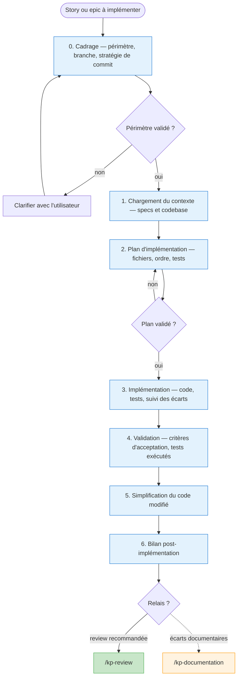

---

### 5. Review (`/kp-review`)

**Rôle** : Reviewer senior. Relit, teste et valide le code produit par le Developer. Émet un verdict GO/NO-GO et écrit les recommandations d'amélioration dans la story.

**Modes** : story (une story) ou epic (toutes les stories en REVIEW/DONE).

**Sortie** : section Review ajoutée dans la story, verdict GO/NO-GO.

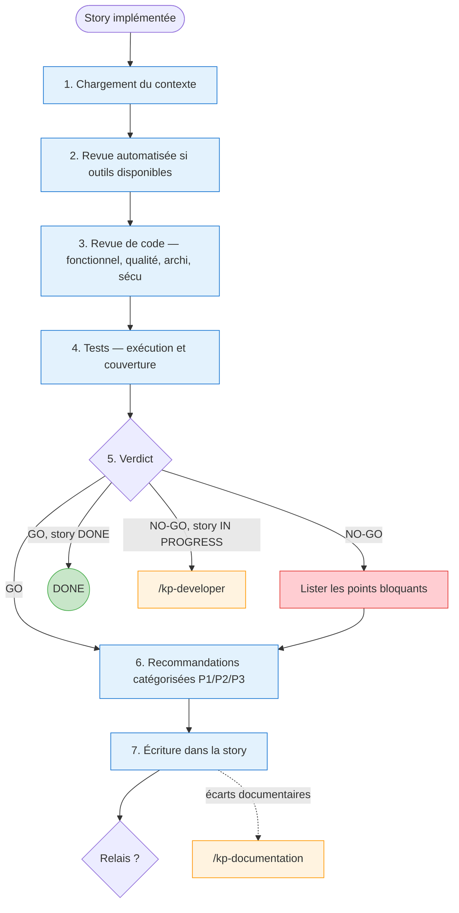

---

### 6. Documentation (`/kp-documentation`)

**Rôle** : responsable documentation technique et produit. Analyse la documentation existante, identifie les divergences avec le code, propose des corrections et maintient la documentation après validation.

**Modes** : interactif, analyse de code, ou maintenance documentaire.

**Sortie** : documents mis à jour dans `docs/`, `docs/INDEX.md` maintenu.

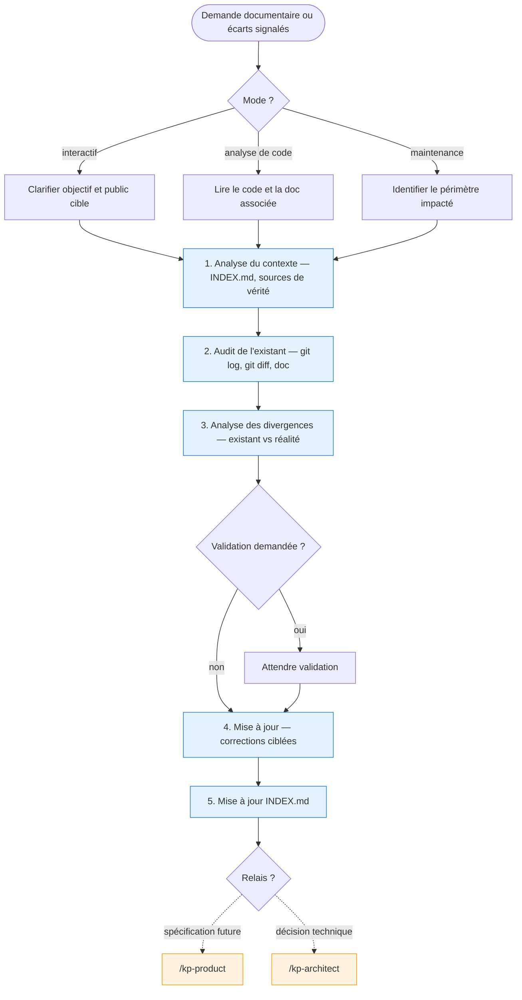

---

### 7. UX/UI (`/kp-ux-ui`)

**Rôle** : Designer UX/UI senior. Conçoit des interfaces intuitives et visuellement distinctives. Travaille entre Product et Developer.

**Modes** : discovery (exploration UX), feature (conception liée à une epic) ou audit (analyse critique).

**Sortie** : `docs/features/<group>/ux.md`, `docs/features/<group>/ui.md`, `docs/design-system.md`.

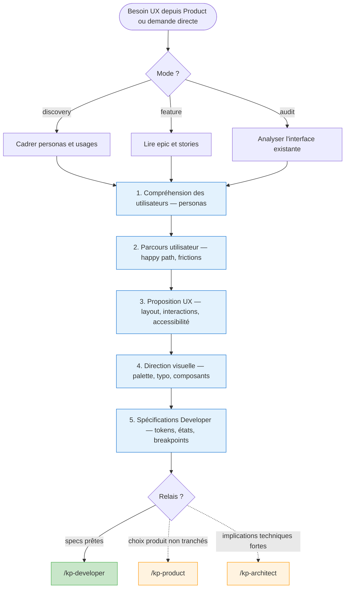

---

## Agents RecetteMoi — Détail

---

### 8. RecetteMoi Support (`/kp-recettemoi-support`)

**Rôle** : porte d'entrée unique de la gestion des tickets RecetteMoi. Trie les tickets, filtre ceux en attente, analyse la nature du ticket et passe le relais au skill adapté.

**Types de tickets** : BUG, IMPROVEMENT, IDEA, QUESTION, COMPLIMENT.

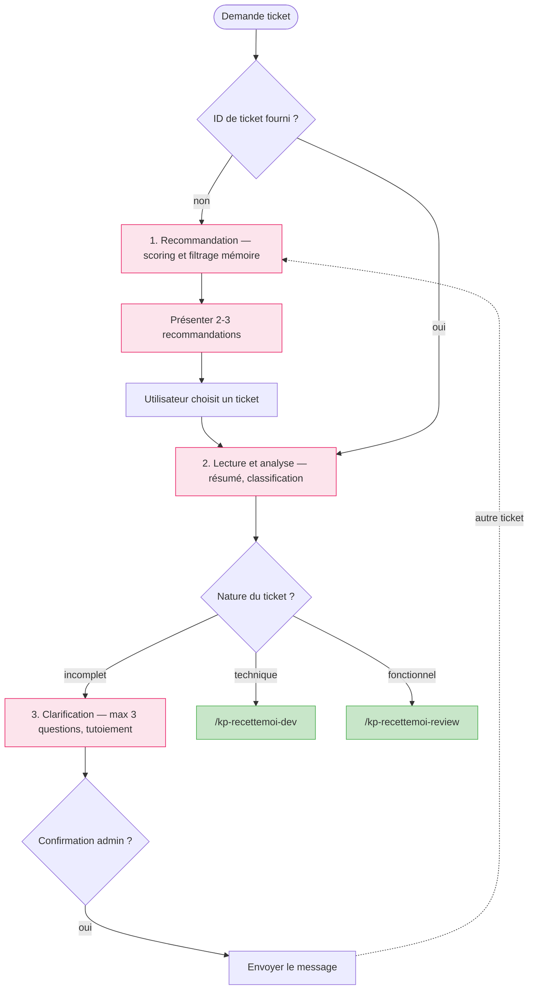

**Chemin obligatoire** : lecture du ticket --> classification --> handoff (dev ou review)
**Chemins facultatifs** : recommandation (si pas d'ID), clarification (si ticket incomplet)

---

### 9. RecetteMoi Dev (`/kp-recettemoi-dev`)

**Rôle** : traitement technique des tickets BUG ou IMPROVEMENT avec impact code. Analyse, crée une branche, implémente via `/kp-developer`, commit/push, puis passe le relais à recettemoi-review.

**Entrée obligatoire** : contexte transmis depuis recettemoi-support.

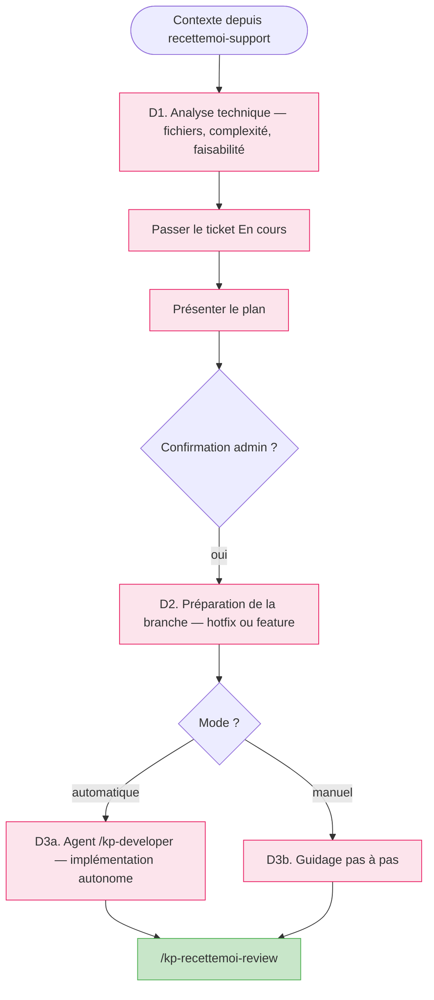

**Chemin obligatoire** : analyse --> branche --> implémentation --> handoff review
**Choix interne** : mode automatique (agent) ou manuel (guidé)

---

### 10. RecetteMoi Review (`/kp-recettemoi-review`)

**Rôle** : validation et réponse utilisateur. Rédige une réponse fonctionnelle (depuis support) ou valide le rapport technique (depuis dev) et prépare la communication utilisateur. Conclut le cycle de vie du ticket.

**Entrée obligatoire** : contexte transmis depuis recettemoi-support ou recettemoi-dev.

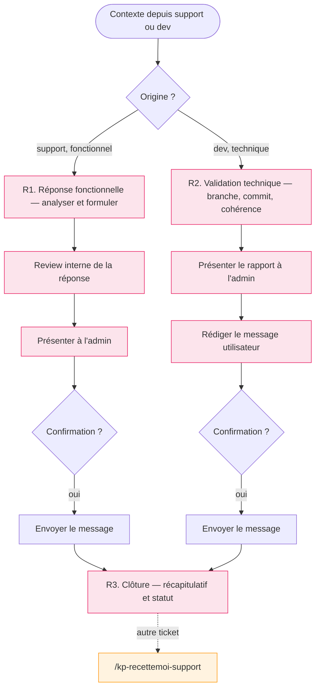

**Chemin obligatoire** : selon l'origine, R1 (fonctionnel) ou R2 (technique) --> clôture
**Chemin facultatif** : retour vers support pour un autre ticket

---

## Légende des schémas

| Élément | Signification |
|---------|---------------|
| Trait plein (`-->`) | Chemin **obligatoire** |
| Trait pointillé (`-.->`) | Chemin **facultatif** |
| Fond bleu clair | Étape interne de l'agent |
| Fond rose clair | Étape interne (agents RecetteMoi) |
| Fond vert | Sortie obligatoire / destination principale |
| Fond orange | Sortie facultative / relais conditionnel |
| Fond rouge clair | Point bloquant |
| Losange | Point de décision |
| Cercle double | Fin du flux |
