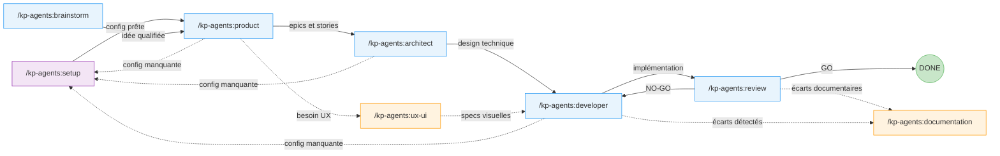
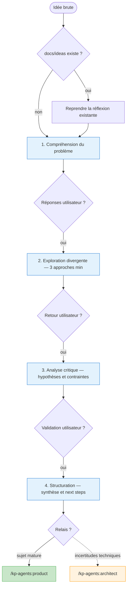
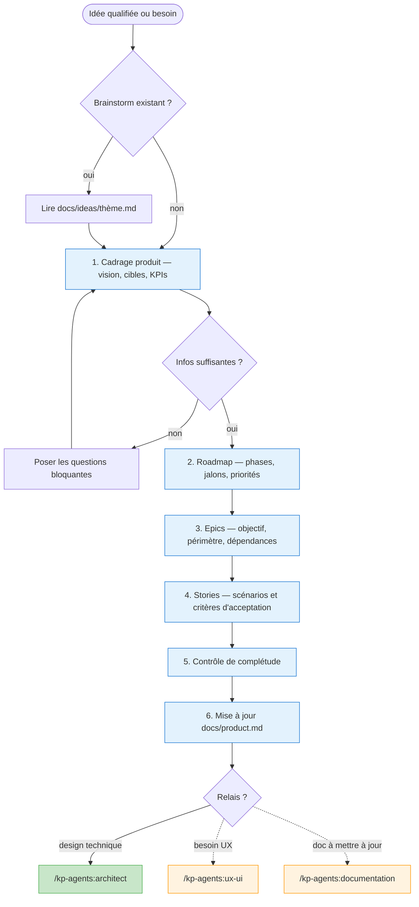
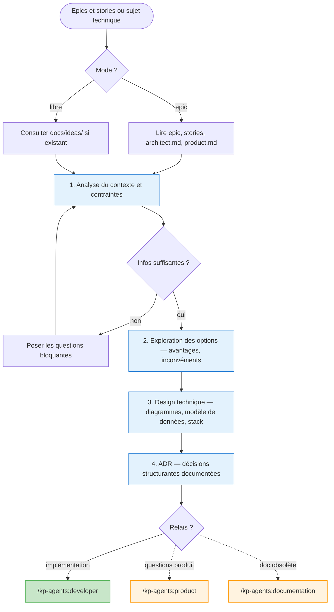
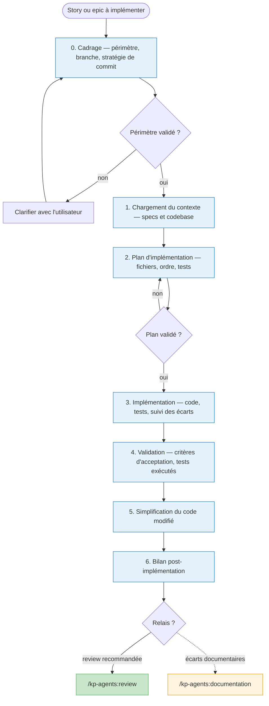
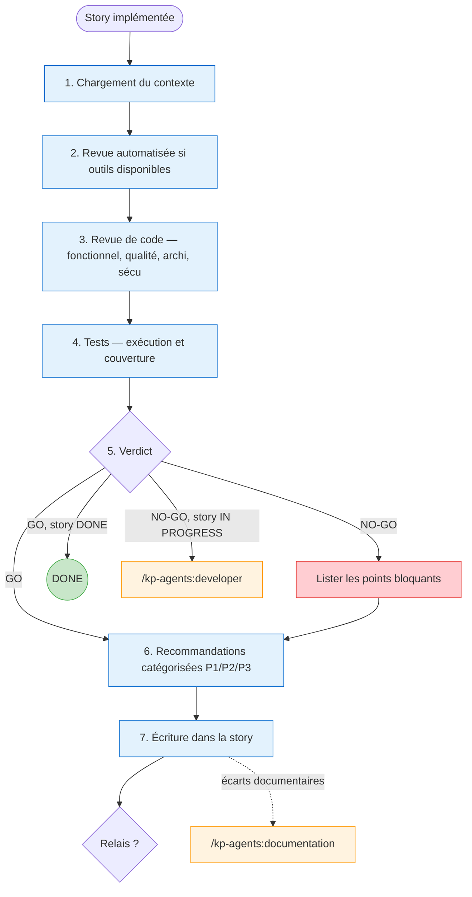
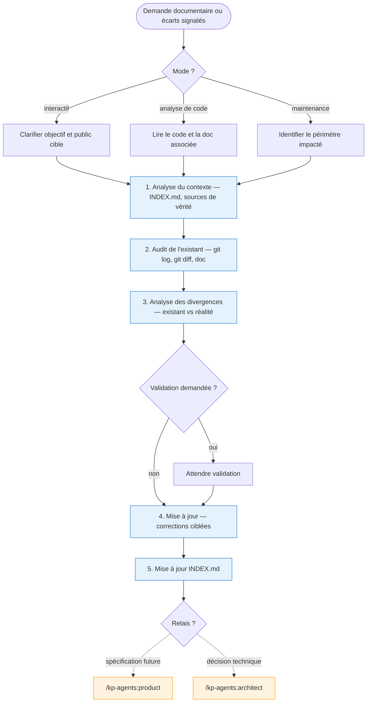
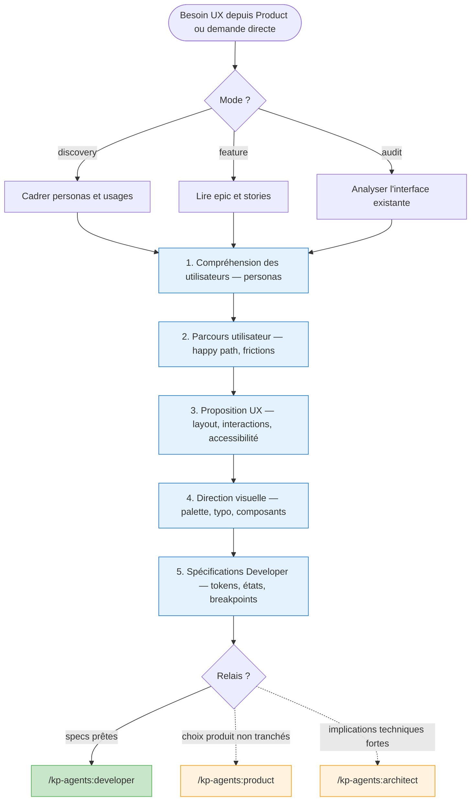
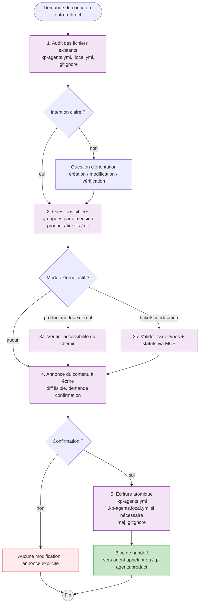

# Guide des agents

> Description de chaque agent et visualisation de leurs workflows.
> Les traits pleins (`-->`) indiquent les chemins **obligatoires**. Les traits pointillés (`-.->`) indiquent les chemins **facultatifs**.

> **Invocation** : via le plugin Claude Code, les agents sont namespacés sous la forme `/kp-agents:<nom>`. Dans Cursor, ils apparaissent sous `@kp-<nom>`. Dans Codex, ce sont les skills `kp-<nom>`.

---

## Vue d'ensemble

Le projet expose **8 agents** : 7 agents génériques pour le workflow de développement (de l'exploration d'une idée à la validation du code implémenté) + 1 agent transversal `setup` pour la configuration projet (`.kp-agents.yml` / `.kp-agents.local.yml`). Les agents sont indépendants mais chaînables via un bloc de handoff structuré.

---

## Routing — Quand appeler quel agent

Table de référence machine-readable. Signaux = mots-clés ou contexte déclencheur. `requires` = condition nécessaire. `anti` = cas d'exclusion explicite.

| Signal déclencheur | Agent | Requires | Anti (→ autre agent) |
|---|---|---|---|
| « idée », « et si on », « je réfléchis à », « challenge mon hypothèse », « brainstorm » | `brainstorm` | — | Idée déjà qualifiée avec critères d'acceptation → `product` |
| « story », « epic », « roadmap », « spec », « user story », « critères d'acceptation », « priorise », « découpe » | `product` | — | Implémentation de code → `developer` |
| « architecture », « ADR », « choix technique », « quelle lib », « quel pattern », « latence », « volumétrie », besoin non-fonctionnel | `architect` | — | Implémentation pure → `developer` ; cadrage produit → `product` |
| « implémente », « code », « développe », « ajoute la feature », ID story `S-XXXX`, ID epic `E-XXXX` | `developer` | Story ou epic documentée dans `docs/` | Rédiger une spec → `product` ; design archi → `architect` |
| « review », « valide », « vérifie », « c'est prêt ? », « peux-tu vérifier », story en statut `REVIEW` | `review` | Story implémentée | Corriger ou écrire du code → `developer` |
| « écran », « parcours utilisateur », « persona », « wireframe », « palette », « identité visuelle », « UX », « UI » | `ux-ui` | — | Spec produit → `product` ; implémentation CSS/front → `developer` |
| « audite la doc », « documente X », « la doc est fausse », « qu'est-ce qui manque », « INDEX », post-implémentation | `documentation` | — | Nouvelle spec → `product` ; nouveau design → `architect` |
| « configure les sources », « setup le projet », « où vit la doc », config manquante détectée par un agent | `setup` | — | — |

> Cette table est lue par les agents via `context.routing` (`.kp-context.yml`). Elle remplace les indications de routing textuelles dispersées dans chaque skill.

---

## Pipeline développement — Vue globale

**Chemin obligatoire** : brainstorm --> product --> architect --> developer --> review
**Agents transversaux** (facultatifs) : ux-ui (entre product et developer), documentation (après review ou developer), setup (auto-redirect depuis tout agent détectant une config manquante)

---

## Agents — Détail

---

### 1. Brainstorm (`/kp-agents:brainstorm`)

**Rôle** : facilitateur de brainstorming. Explore une idée sous tous ses angles, propose des approches créatives et structure la réflexion pour la faire avancer concrètement.

**Sortie** : fichier `docs/ideas/<thème>.md` mis à jour progressivement.

---

### 2. Product (`/kp-agents:product`)

**Rôle** : Product Manager. Transforme des idées brutes en spécifications produit actionnables : vision, roadmap, epics et stories avec critères d'acceptation.

**Sortie** : `docs/product.md`, `docs/project/roadmap.md`, epics et stories dans `docs/project/epics/`.

---

### 3. Architect (`/kp-agents:architect`)

**Rôle** : Architecte logiciel senior. Conçoit des solutions techniques solides, évalue les compromis et documente les décisions d'architecture (ADR).

**Modes** : libre (réflexion technique sans epic) ou epic (conception liée à une epic produit).

**Sortie** : `docs/architect.md`, `docs/features/<group>/architect.md`, ADR.

---

### 4. Developer (`/kp-agents:developer`)

**Rôle** : Développeur senior. Implémente les fonctionnalités en suivant rigoureusement les spécifications produit et techniques documentées.

**Modes** : story (une story) ou epic (toutes les stories séquentiellement).

**Sortie** : code implémenté, stories mises à jour avec sections Implémentation et Validation.

---

### 5. Review (`/kp-agents:review`)

**Rôle** : Reviewer senior. Relit, teste et valide le code produit par le Developer. Émet un verdict GO/NO-GO et écrit les recommandations d'amélioration dans la story.

**Modes** : story (une story) ou epic (toutes les stories en REVIEW/DONE).

**Sortie** : section Review ajoutée dans la story, verdict GO/NO-GO.

---

### 6. Documentation (`/kp-agents:documentation`)

**Rôle** : responsable documentation technique et produit. Analyse la documentation existante, identifie les divergences avec le code, propose des corrections et maintient la documentation après validation.

**Modes** : interactif, analyse de code, ou maintenance documentaire.

**Sortie** : documents mis à jour dans `docs/`, `docs/INDEX.md` maintenu.

---

### 7. UX/UI (`/kp-agents:ux-ui`)

**Rôle** : Designer UX/UI senior. Conçoit des interfaces intuitives et visuellement distinctives. Travaille entre Product et Developer.

**Modes** : discovery (exploration UX), feature (conception liée à une epic) ou audit (analyse critique).

**Sortie** : `docs/features/<group>/ux.md`, `docs/features/<group>/ui.md`, `docs/design-system.md`.

---

### 8. Setup (`/kp-agents:setup`)

**Rôle** : configurateur du projet. Audite l'état de `.kp-agents.yml` et `.kp-agents.local.yml`, guide l'utilisateur pas à pas pour les compléter ou les corriger, et écrit les fichiers de config sans jamais écraser sans confirmation. **Seul agent autorisé** à écrire `.kp-agents.yml` et `.kp-agents.local.yml` — les 7 autres agents sont en lecture seule sur ces fichiers.

**Dimensions gérées** (3, indépendantes) :
- **`product`** : mode local ou external (OneDrive), avec option `access: read-only` si le PM humain maintient la doc ailleurs.
- **`tickets`** : mode local ou MCP (JIRA), avec matrice de mapping configurable par projet.
- **`git`** : `branch_pattern`, `auto_commit`, `auto_push` — préférences Git d'équipe.

**Sortie** : `.kp-agents.yml` (commité, politique partagée), `.kp-agents.local.yml` (gitignoré, chemins machine et override local), ajout automatique de l'entrée `.kp-agents.local.yml` au `.gitignore`.

**Auto-redirect** : tout agent qui détecte une config manquante / incomplète dans `.kp-agents.yml` propose `/kp-agents:setup` à l'utilisateur — la redirection est une **suggestion, jamais un blocage**. L'utilisateur peut toujours refuser et continuer en mode local dégradé.

---

## Légende des schémas

| Élément | Signification |
|---------|---------------|
| Trait plein (`-->`) | Chemin **obligatoire** |
| Trait pointillé (`-.->`) | Chemin **facultatif** |
| Fond bleu clair | Étape interne de l'agent |
| Fond vert | Sortie obligatoire / destination principale |
| Fond orange | Sortie facultative / relais conditionnel |
| Fond rouge clair | Point bloquant |
| Losange | Point de décision |
| Cercle double | Fin du flux |
