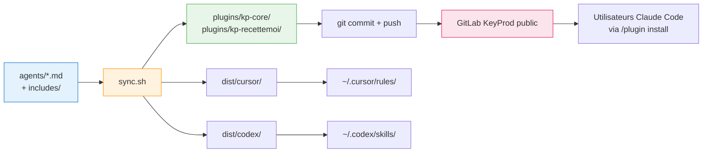

# Architecture - kp-agents

## Résumé technique

kp-agents est un système de distribution multi-cibles d'agents IA. Une source unique (`agents/*.md` avec frontmatter + directives `{{include:xxx}}`) est transformée par un script bash (`sync.sh`) en artefacts natifs pour trois plateformes cibles :

- **Claude Code** : marketplace installable via URL git (format plugin natif)
- **Cursor** : règles `.mdc` installées dans `~/.cursor/rules/`
- **Codex** : skills `SKILL.md` installées dans `~/.codex/skills/`

La marketplace Claude expose **deux plugins distincts** :
- `kp-core` — 7 agents génériques (brainstorm, product, architect, developer, review, documentation, ux-ui)
- `kp-recettemoi` — 3 agents RecetteMoi (support, dev, review)

L'indépendance des deux plugins permet à un consommateur externe d'installer uniquement `kp-core` sans récupérer les agents métier internes.

## Objectifs et contraintes

### Objectifs techniques
- Installation d'un plugin Claude en **une commande** (`/plugin install kp-core@kp-agents`)
- Conservation de la source unique : un agent se modifie à un seul endroit (`agents/<nom>.md`)
- Simplification de `sync.sh` : retrait de la cible Claude (gérée par le mécanisme plugin natif)
- Support du versioning semver (sémantique de releases)

### Contraintes techniques
- **Cache d'installation** : Claude Code copie chaque plugin dans `~/.claude/plugins/cache/…`. Aucun fichier hors du dossier du plugin n'est accessible. → les `{{include:xxx}}` doivent être résolus avant commit
- **Hébergement public obligatoire** : consommateurs externes sans compte GitLab → repo GitLab KeyProd en visibilité publique (HTTPS anonyme)
- **Namespacing imposé** : les skills sont préfixés du nom du plugin (`/kp-core:brainstorm`, pas `/kp-brainstorm`)
- **Versioning détecté par `plugin.json`** : Claude Code détecte les mises à jour via le champ `version`. Un nouveau commit sans bump ne déclenche pas d'update
- **Contenu commité** : tous les fichiers nécessaires à l'installation (dont le dossier `plugins/`) doivent être versionnés dans git

### Contraintes non fonctionnelles
- **Reproductibilité** : `agents/` + `sync.sh` produisent toujours le même `plugins/` pour un input donné
- **Simplicité** : un dev doit comprendre le pipeline en < 10 minutes
- **Zéro duplication humaine** : aucune règle ne doit être écrite deux fois dans deux fichiers différents

## Architecture d'ensemble

### Arborescence cible du repo

```
kp-agents/
├── .claude-plugin/
│   └── marketplace.json                    # catalogue : référence les 2 plugins
├── plugins/                                # GÉNÉRÉ par sync.sh, COMMITÉ
│   ├── kp-core/
│   │   ├── .claude-plugin/
│   │   │   └── plugin.json                 # name: kp-core, version, description
│   │   └── skills/
│   │       ├── brainstorm/
│   │       │   └── SKILL.md                # includes résolus, markdown final
│   │       ├── product/SKILL.md
│   │       ├── architect/SKILL.md
│   │       ├── developer/SKILL.md
│   │       ├── review/SKILL.md
│   │       ├── documentation/SKILL.md
│   │       └── ux-ui/SKILL.md
│   └── kp-recettemoi/
│       ├── .claude-plugin/
│       │   └── plugin.json                 # name: kp-recettemoi, version, description
│       └── skills/
│           ├── support/SKILL.md
│           ├── dev/SKILL.md
│           └── review/SKILL.md
├── agents/                                 # SOURCE de vérité (inchangé)
│   ├── brainstorm.md
│   ├── product.md
│   └── ... (10 fichiers)
├── includes/                               # templates partagés (inchangé)
│   ├── guardrails.md
│   ├── handoff.md
│   └── ...
├── dist/                                   # GÉNÉRÉ, NON COMMITÉ (.gitignore)
│   ├── cursor/kp-*.mdc
│   └── codex/kp-*/
├── docs/                                   # doc projet (inchangé)
├── sync.sh                                 # transformateur
├── CLAUDE.md
├── README.md
└── .gitignore                              # dist/, .installed-agents
```

### Diagramme de flux



Légende :
- Bleu : source de vérité humaine
- Orange : transformation automatisée
- Vert : artefact versionné
- Rose : canal de distribution

## Composants

### `agents/*.md` — Source de vérité

- **Responsabilité** : définir un agent (prompt, rôle, règles) dans un format enrichi propre au projet
- **Format** : frontmatter YAML (`name`, `description`, `short_description`, `default_prompt`) + corps markdown avec directives `{{include:nom}}`
- **Source de vérité** : ce dossier est la seule source modifiée à la main
- **Fichiers** : 10 agents (7 dans scope `kp-core`, 3 dans scope `kp-recettemoi`)

### `includes/*.md` — Templates partagés

- **Responsabilité** : fournir des blocs réutilisables (guardrails, handoff, docs-structure) injectables via `{{include:nom}}`
- **Usage** : résolus par `sync.sh` au moment de la génération — invisibles aux cibles
- **Non commités dans `plugins/`** : non accessibles depuis les plugins après install (cache Claude Code)

### `sync.sh` — Transformateur

- **Responsabilité** : lire `agents/` + `includes/`, produire trois sorties : `plugins/`, `dist/cursor/`, `dist/codex/`
- **Ne génère plus pour Claude local** (`~/.claude/commands/`) : la distribution Claude passe exclusivement par le plugin marketplace
- **Cibles d'installation locale** : `~/.cursor/rules/` et `~/.codex/skills/` (inchangé)
- **Manifeste** : le fichier `.installed-agents` continue de tracker les installations Cursor/Codex

### `plugins/` — Artefacts plugin Claude

- **Responsabilité** : contenir les deux plugins au format Claude Code natif, prêts à être installés
- **Statut git** : **commité** (contrairement à `dist/`). Les consommateurs reçoivent ce dossier via git clone
- **Cohérence** : doit être à jour par rapport à `agents/` à chaque commit → garde-fou à mettre en place (pre-commit ou CI)

### `.claude-plugin/marketplace.json` — Catalogue

- **Responsabilité** : déclarer les deux plugins disponibles et leurs emplacements relatifs
- **Statut git** : commité, statique (ne change que si on ajoute/retire un plugin)

### `dist/` — Artefacts Cursor + Codex

- **Responsabilité** : sorties générées pour Cursor (`*.mdc`) et Codex (`SKILL.md`)
- **Statut git** : **non commité** (`.gitignore`). Regénéré à chaque `sync.sh`

## Données et contrats

### Contrat frontmatter `agents/<nom>.md`

```yaml
---
name: <nom>                         # identifiant sans préfixe (ex: brainstorm)
description: "..."                  # description longue
short_description: "..."            # description courte (Codex display_name)
default_prompt: "..."               # prompt suggéré (Codex)
---
```

### Contrat `marketplace.json` (statique)

```json
{
  "name": "kp-agents",
  "owner": {
    "name": "KeyProd",
    "email": "<à définir>"
  },
  "metadata": {
    "description": "Agents IA KeyProd pour Claude Code",
    "pluginRoot": "./plugins"
  },
  "plugins": [
    {
      "name": "kp-core",
      "source": "kp-core",
      "description": "Agents génériques : brainstorm, product, architect, developer, review, documentation, ux-ui"
    },
    {
      "name": "kp-recettemoi",
      "source": "kp-recettemoi",
      "description": "Agents RecetteMoi : support, dev, review"
    }
  ]
}
```

`pluginRoot` permet d'écrire des sources courtes (`"kp-core"` au lieu de `"./plugins/kp-core"`).

### Contrat `plugins/<plugin>/.claude-plugin/plugin.json`

```json
{
  "name": "kp-core",
  "description": "KeyProd agents génériques pour workflow de développement",
  "version": "0.1.0",
  "author": {
    "name": "KeyProd"
  }
}
```

**Important** : le champ `version` est la source de détection de mise à jour côté client. Tout changement de plugin nécessite un bump.

### Contrat `plugins/<plugin>/skills/<nom>/SKILL.md`

```markdown
---
description: "<description longue issue de agents/<nom>.md>"
---

<corps markdown, includes résolus>
```

Frontmatter minimal : uniquement `description` (le champ clé que Claude utilise pour décider d'invoquer le skill). Pas de `disable-model-invocation` → les skills sont à la fois user-invocables (`/kp-core:brainstorm`) et model-invocables (Claude peut décider d'utiliser `brainstorm` selon contexte).

## Décisions techniques

### ADR-001 — Marketplace avec 2 plugins distincts (vs plugin monolithique)

- **Statut** : accepted
- **Contexte** : le projet expose 10 agents répartis en 2 domaines fonctionnels (7 génériques + 3 RecetteMoi). Les consommateurs externes à KeyProd n'ont besoin que des génériques.
- **Décision** : la marketplace `kp-agents` contient 2 plugins indépendants : `kp-core` (7 skills) et `kp-recettemoi` (3 skills). Un utilisateur peut installer l'un sans l'autre.
- **Conséquences** :
  - ✅ Extensibilité : ajouter un futur plugin (ex: `kp-clients-projetX`) devient trivial
  - ✅ Séparation de périmètres : les externes installent `kp-core` uniquement
  - ✅ Namespaces distincts : pas de conflit possible entre les deux plugins
  - ⚠️ Versioning à gérer séparément pour chaque plugin
- **Alternatives rejetées** :
  - **Plugin monolithique `kp-agents`** : oblige les externes à prendre les agents RecetteMoi qui n'ont aucun sens pour eux, couple les releases
  - **Branches git séparées** (une par plugin) : complexité supérieure (2 refs à maintenir), rend l'architecture multi-plugins manifeste impossible, duplique les agents communs

### ADR-002 — `agents/` reste source, `plugins/` est généré et commité

- **Statut** : accepted
- **Contexte** : les directives `{{include:guardrails}}`, `{{include:handoff}}`, `{{include:docs-structure}}` factorisent des blocs communs entre agents. Claude Code copie chaque plugin dans un cache isolé → les includes doivent être résolus **avant** que le plugin n'atteigne le cache.
- **Décision** : `agents/*.md` reste la source de vérité avec les directives. `sync.sh` résout les includes et génère `plugins/<plugin>/skills/<nom>/SKILL.md` en markdown final. Le dossier `plugins/` est **commité** dans git (obligatoire pour distribution via URL git).
- **Conséquences** :
  - ✅ Zéro duplication humaine (les includes restent factorisés)
  - ✅ Compatible avec le cache Claude Code (markdown final déjà résolu)
  - ⚠️ Discipline : un dev doit lancer `sync.sh` avant tout commit touchant un agent. Risque de désynchronisation → mitigation via pre-commit hook et/ou CI
- **Alternatives rejetées** :
  - **Duplication des includes dans chaque plugin** : double maintenance, source divergence
  - **Résolution côté Claude Code** : non supporté, le cache ne copie que le dossier du plugin

### ADR-003 — `sync.sh` retire la cible Claude locale

- **Statut** : accepted
- **Contexte** : le mécanisme plugin Claude Code remplace complètement l'installation directe dans `~/.claude/commands/`. La cohabitation créerait des conflits (deux installations pour les mêmes agents).
- **Décision** : `sync.sh` ne gère plus que deux cibles : `dist/cursor/` et `dist/codex/` (+ la génération de `plugins/` pour distribution plugin). Les fonctions `generate_claude*` sont supprimées. Les flags `--clean` et `--clean-all` sont adaptés pour ne plus toucher à `~/.claude/commands/`.
- **Conséquences** :
  - ✅ Simplification drastique (~30% du code de `sync.sh` supprimé)
  - ✅ Pas de risque de double installation
  - ⚠️ Migration requise pour les devs ayant déjà installé via l'ancien `sync.sh` : un script de nettoyage one-shot suffit
- **Alternatives rejetées** :
  - **Garder la génération Claude locale en parallèle** : cohabitation impossible sans namespaces différents, dette technique

### ADR-004 — Versioning semver manuel au départ

- **Statut** : accepted
- **Contexte** : Claude Code détecte les mises à jour d'un plugin via le champ `version` de `plugin.json`. Sans bump, un nouveau commit ne déclenchera pas d'update chez les clients.
- **Décision** : adopter **semver manuel** au départ. Chaque plugin a sa propre version dans son `plugin.json`. Le dev bump à la main (patch par défaut, mineur si ajout d'agent, majeur si rupture comportementale). Un tag git correspondant est poussé (`kp-core-v0.2.0`, `kp-recettemoi-v0.1.0`). Évolution possible vers auto-bump basé sur hash du skill.
- **Conséquences** :
  - ✅ Simplicité : pas d'outillage à mettre en place
  - ✅ Contrôle humain sur les ruptures communiquées
  - ⚠️ Risque d'oubli : un bug fix non bumpé n'atteint pas les clients → à mitiger par un CHANGELOG obligatoire
- **Alternatives rejetées** :
  - **Auto-bump via hash** : à envisager après v1.0, prématuré maintenant
  - **Single version pour toute la marketplace** : casse l'ADR-001 (indépendance des plugins)

## Sécurité, performance et opérations

### Sécurité

- **Repo public** : aucun secret, aucune donnée sensible ne doit être committée. Vérifier qu'aucun agent ne fait référence à des URLs internes, tokens, ou informations clients
- **Origine du plugin** : les utilisateurs externes font confiance au domaine GitLab KeyProd. Privilégier la visibilité publique **au niveau du projet** (pas "internal"), vérifiable via HTTPS anonyme
- **Pas d'exécutables** : nos plugins ne contiennent que du markdown. Pas de `bin/`, pas de hooks shell. → Surface d'attaque minimale

### Performance

- Pas d'enjeu — les skills sont des fichiers markdown statiques. Volume total < 1 Mo

### Observabilité

- Pas applicable — distribution statique. En cas de problème, un consommateur fait un `git clone` pour inspecter

### Opérations

- **Workflow de release** :
  1. Modifier `agents/<nom>.md`
  2. Lancer `./sync.sh`
  3. Vérifier `git diff plugins/`
  4. Bumper la version dans le `plugin.json` du plugin impacté
  5. Commit (`feat(kp-core): ...` ou `fix(kp-core): ...`)
  6. Tag (`git tag kp-core-v0.2.1`)
  7. Push + push tags
- **Rollback** : `git revert` du commit problématique + bump de version (semver ne permet pas de descendre)
- **CI recommandée** (après v0.1.0) : un job qui relance `sync.sh` et échoue si `git diff plugins/` produit un delta (garantit la synchronisation source/généré)

## Spike de faisabilité — Étape 1

Objectif : valider **avant refonte complète** que le pipeline marketplace + plugin + GitLab public + install Claude fonctionne bout-en-bout.

### Portée du spike

- **1 plugin** : `kp-core-spike`
- **1 skill** : `brainstorm` (reprend le contenu actuel de `dist/codex/kp-brainstorm/SKILL.md`)
- **Branche git dédiée** : `spike-plugin` (permet de ne pas polluer `main`)

### Fichiers à produire

```
<racine>/
├── .claude-plugin/marketplace.json
└── plugins/
    └── kp-core-spike/
        ├── .claude-plugin/plugin.json
        └── skills/
            └── brainstorm/SKILL.md
```

Contenu `.claude-plugin/marketplace.json` :
```json
{
  "name": "kp-agents-spike",
  "owner": { "name": "KeyProd" },
  "metadata": {
    "description": "Spike de faisabilité — ne pas utiliser en production",
    "pluginRoot": "./plugins"
  },
  "plugins": [
    {
      "name": "kp-core-spike",
      "source": "kp-core-spike",
      "description": "Plugin de spike — 1 seul agent (brainstorm)"
    }
  ]
}
```

Contenu `plugins/kp-core-spike/.claude-plugin/plugin.json` :
```json
{
  "name": "kp-core-spike",
  "description": "Spike de faisabilité KeyProd",
  "version": "0.0.1",
  "author": { "name": "KeyProd" }
}
```

Contenu `plugins/kp-core-spike/skills/brainstorm/SKILL.md` :
```markdown
---
description: "KeyProd Brainstorm: explore approaches, challenge assumptions, and structure next steps"
---

<copier ici le contenu résolu de agents/brainstorm.md>
```

### Protocole de test

1. Pousser la branche `spike-plugin` sur GitLab KeyProd avec **visibilité publique**
2. Depuis un poste "vierge" (un autre dev, ou machine sans authentification GitLab) :
   ```
   /plugin marketplace add https://<gitlab-keyprod>/kp-agents.git#spike-plugin
   /plugin install kp-core-spike@kp-agents-spike
   /reload-plugins
   /kp-core-spike:brainstorm
   ```
3. Vérifier que :
   - ✅ `/plugin marketplace add` réussit sans authentification
   - ✅ `/plugin install` télécharge le plugin
   - ✅ Le skill `brainstorm` est invocable avec le namespace attendu
   - ✅ Le contenu du skill s'exécute correctement

### Critères GO / NO-GO

- **GO** : les 4 vérifications passent → on enchaîne sur la refonte structurante (étape 2)
- **NO-GO partiel** (ex: problème de visibilité publique GitLab) : ajuster l'hébergement avant de refondre
- **NO-GO total** (ex: format non reconnu) : retour brainstorm pour explorer une variante (GitHub public, ou archive tarball hébergée)

### Estimation

1-2h de travail. Artefacts jetables après validation (la branche `spike-plugin` peut être supprimée).

## Dette, risques et points à valider

### Risques identifiés

| Risque | Probabilité | Impact | Mitigation |
|---|---|---|---|
| Visibilité publique GitLab KeyProd indisponible (conf admin) | Moyenne | Élevé | Spike HC-2 vérifie en amont. Fallback : miroir GitHub public |
| Désynchronisation `agents/` ↔ `plugins/` | Élevée | Moyen | Pre-commit hook + CI check |
| Namespacing différent de `/kp-core:brainstorm` (shorthand ?) | Faible | Faible | Spike vérifie. Doc officielle suggère exact match |
| Oubli de bump version | Moyenne | Moyen | CHANGELOG obligatoire + lint de version |
| Migration des utilisateurs actuels (ceux qui ont fait `sync.sh`) | Faible | Faible | Script one-shot + message dans `sync.sh` pendant 2-3 semaines |

### Points à valider par l'utilisateur

- Nom exact du domaine GitLab KeyProd (pour la doc et le spike)
- Email owner à mettre dans `marketplace.json`
- Stratégie de pre-commit : hook local ou CI uniquement ?
- Nom définitif du plugin de spike (`kp-core-spike` est un placeholder)

## Références

- [Idée qualifiée — plugin Claude Code](ideas/plugin-claude-code.md)
- [Doc officielle — Create plugins](https://code.claude.com/docs/en/plugins)
- [Doc officielle — Create plugin marketplace](https://code.claude.com/docs/en/plugin-marketplaces)
- [Doc officielle — Discover plugins](https://code.claude.com/docs/en/discover-plugins)
- [README projet](../README.md)
- [CLAUDE.md](../CLAUDE.md)
