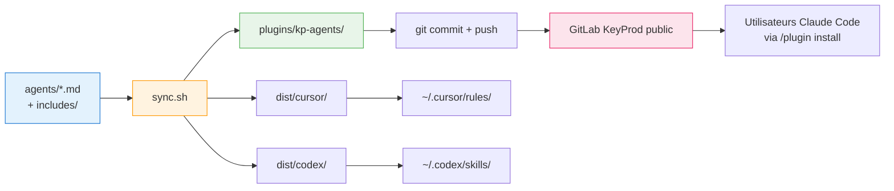

# Architecture - kp-agents

## Résumé technique

kp-agents est un système de distribution multi-cibles d'agents IA. Une source unique (`agents/*.md` avec frontmatter + directives `{{include:xxx}}`) est transformée par un script bash (`sync.sh`) en artefacts natifs pour trois plateformes cibles :

- **Claude Code** : marketplace installable via URL git (format plugin natif)
- **Cursor** : règles `.mdc` installées dans `~/.cursor/rules/`
- **Codex** : depuis la 4.2.0, plugin installé par la même marketplace git que Claude Code (`.codex-plugin/plugin.json` → `codex/`) ; auparavant, skills copiées par `sync.sh` dans `~/.codex/skills/`

La marketplace Claude expose **un plugin** :
- `kp-agents` — 7 agents génériques (brainstorm, product, architect, developer, review, documentation, ux-ui)

L'architecture marketplace permet d'ajouter d'autres plugins à l'avenir (ex: `kp-projet-X` pour des agents métier spécifiques) sans refonte structurante. Les agents RecetteMoi initialement prévus comme second plugin ont été retirés du périmètre (décision 2026-04-17).

## Objectifs et contraintes

### Objectifs techniques
- Installation d'un plugin Claude en **une commande** (`/plugin install kp-agents@kp-agents`)
- Conservation de la source unique : un agent se modifie à un seul endroit (`agents/<nom>.md`)
- Simplification de `sync.sh` : retrait de la cible Claude (gérée par le mécanisme plugin natif)
- Support du versioning semver (sémantique de releases)

### Contraintes techniques
- **Cache d'installation** : Claude Code copie chaque plugin dans `~/.claude/plugins/cache/…`. Aucun fichier hors du dossier du plugin n'est accessible. → les `{{include:xxx}}` doivent être résolus avant commit
- **Hébergement public obligatoire** : consommateurs externes sans compte GitLab → repo GitLab KeyProd en visibilité publique (HTTPS anonyme)
- **Namespacing imposé** : les skills sont préfixés du nom du plugin (`/kp-agents:brainstorm`, pas `/kp-brainstorm`)
- **Versioning détecté par `plugin.json`** : Claude Code détecte les mises à jour via le champ `version`. Un nouveau commit sans bump ne déclenche pas d'update
- **Contenu commité** : tous les fichiers nécessaires à l'installation (dont le dossier `plugins/`) doivent être versionnés dans git

### Contraintes non fonctionnelles
- **Reproductibilité** : `agents/` + `sync.sh` produisent toujours le même `plugins/` pour un input donné
- **Simplicité** : un dev doit comprendre le pipeline en < 10 minutes
- **Zéro duplication humaine** : aucune règle ne doit être écrite deux fois dans deux fichiers différents

## Architecture d'ensemble

### Arborescence cible du repo

```
kp-agents/
├── .claude-plugin/
│   └── marketplace.json                    # catalogue : référence les 2 plugins
├── plugins/                                # GÉNÉRÉ par sync.sh, COMMITÉ
│   └── kp-agents/
│       ├── .claude-plugin/
│       │   └── plugin.json                 # name: kp-agents, version, description
│       └── skills/
│           ├── brainstorm/
│           │   └── SKILL.md                # includes résolus, markdown final
│           ├── product/SKILL.md
│           ├── architect/SKILL.md
│           ├── developer/SKILL.md
│           ├── review/SKILL.md
│           ├── documentation/SKILL.md
│           └── ux-ui/SKILL.md
├── agents/                                 # SOURCE de vérité (inchangé)
│   ├── brainstorm.md
│   ├── product.md
│   └── ... (7 fichiers)
├── includes/                               # templates partagés (inchangé)
│   ├── guardrails.md
│   ├── handoff.md
│   └── ...
├── dist/                                   # GÉNÉRÉ, NON COMMITÉ (.gitignore)
│   ├── cursor/kp-*.mdc
│   └── codex/kp-*/
├── docs/                                   # doc projet (inchangé)
├── sync.sh                                 # transformateur
├── CLAUDE.md
├── README.md
└── .gitignore                              # dist/, .installed-agents
```

### Diagramme de flux



Légende :
- Bleu : source de vérité humaine
- Orange : transformation automatisée
- Vert : artefact versionné
- Rose : canal de distribution

## Composants

### `agents/*.md` — Source de vérité

- **Responsabilité** : définir un agent (prompt, rôle, règles) dans un format enrichi propre au projet
- **Format** : frontmatter YAML (`name`, `description`, `short_description`, `default_prompt`) + corps markdown avec directives `{{include:nom}}`
- **Source de vérité** : ce dossier est la seule source modifiée à la main
- **Fichiers** : 7 agents dans scope `kp-agents`

### `includes/*.md` — Templates partagés

- **Responsabilité** : fournir des blocs réutilisables (guardrails, handoff, docs-structure) injectables via `{{include:nom}}`
- **Usage** : résolus par `sync.sh` au moment de la génération — invisibles aux cibles
- **Non commités dans `plugins/`** : non accessibles depuis les plugins après install (cache Claude Code)

### `sync.sh` — Transformateur

- **Responsabilité** : lire `agents/` + `includes/`, produire trois sorties : `plugins/`, `dist/cursor/`, `dist/codex/`
- **Ne génère plus pour Claude local** (`~/.claude/commands/`) : la distribution Claude passe exclusivement par le plugin marketplace
- **Cibles d'installation locale** : `~/.cursor/rules/` et `~/.codex/skills/` (inchangé)
- **Manifeste** : le fichier `.installed-agents` continue de tracker les installations Cursor/Codex

### `plugins/` — Artefacts plugin Claude

- **Responsabilité** : contenir le plugin `kp-agents` au format Claude Code natif, prêt à être installé
- **Statut git** : **commité** (contrairement à `dist/`). Les consommateurs reçoivent ce dossier via git clone
- **Cohérence** : doit être à jour par rapport à `agents/` à chaque commit → garde-fou à mettre en place (pre-commit ou CI)

### `.claude-plugin/marketplace.json` — Catalogue

- **Responsabilité** : déclarer le plugin `kp-agents` et son emplacement relatif (structure prête à accueillir d'autres plugins à l'avenir)
- **Statut git** : commité, statique (ne change que si on ajoute/retire un plugin)

### `dist/` — Artefacts Cursor + Codex

- **Responsabilité** : sorties générées pour Cursor (`*.mdc`) et Codex (`SKILL.md`)
- **Statut git** : **non commité** (`.gitignore`). Regénéré à chaque `sync.sh`

## Données et contrats

### Contrat frontmatter `agents/<nom>.md`

```yaml
---
name: <nom>                         # identifiant sans préfixe (ex: brainstorm)
description: "..."                  # description longue
short_description: "..."            # description courte (Codex display_name)
default_prompt: "..."               # prompt suggéré (Codex)
---
```

### Contrat `marketplace.json` (statique)

```json
{
  "name": "kp-agents",
  "owner": {
    "name": "KeyProd",
    "email": "<à définir>"
  },
  "metadata": {
    "description": "Agents IA KeyProd pour Claude Code"
  },
  "plugins": [
    {
      "name": "kp-agents",
      "source": "./plugins/kp-agents",
      "description": "Agents génériques : brainstorm, product, architect, developer, review, documentation, ux-ui",
      "version": "0.1.0",
      "author": {
        "name": "KeyProd",
        "email": "contact@keyprod.com"
      }
    }
  ]
}
```

**Note sur `pluginRoot`** : l'option `metadata.pluginRoot` existe mais ne fonctionne pas comme attendu sur la version Claude Code testée (2026-04-17) — le validateur refuse les sources courtes même avec `pluginRoot` défini. On utilise donc systématiquement le chemin complet `./plugins/<nom>`.

### Contrat `plugins/<plugin>/.claude-plugin/plugin.json`

```json
{
  "name": "kp-agents",
  "description": "KeyProd agents génériques pour workflow de développement",
  "version": "0.1.0",
  "author": {
    "name": "KeyProd"
  }
}
```

**Important** : le champ `version` est la source de détection de mise à jour côté client. Tout changement de plugin nécessite un bump.

### Contrat `plugins/<plugin>/skills/<nom>/SKILL.md`

```markdown
---
description: "<description longue issue de agents/<nom>.md>"
---

<corps markdown, includes résolus>
```

Frontmatter minimal : uniquement `description` (le champ clé que Claude utilise pour décider d'invoquer le skill). Pas de `disable-model-invocation` → les skills sont à la fois user-invocables (`/kp-agents:brainstorm`) et model-invocables (Claude peut décider d'utiliser `brainstorm` selon contexte).

## Décisions techniques

### ADR-001 — Marketplace multi-plugins (1 plugin initial, architecture extensible)

- **Statut** : accepted (révisé 2026-04-17)
- **Contexte** : le projet expose 7 agents génériques. L'architecture initiale prévoyait un second plugin `kp-recettemoi`, finalement retiré du périmètre. La structure marketplace reste cependant utile pour une extensibilité future (ex: plugins clients, agents métier spécifiques).
- **Décision** : la marketplace `kp-agents` contient **1 plugin** `kp-agents` (7 skills). La structure marketplace + `plugins/<nom>/` permet d'en ajouter d'autres sans refonte.
- **Conséquences** :
  - ✅ Extensibilité native : ajouter un futur plugin se résume à créer `plugins/<nom>/` + ligne dans `marketplace.json`
  - ✅ Namespaces distincts possibles si plusieurs plugins coexistent
  - ✅ Structure plus simple qu'un split contraint (moins de fichiers à maintenir pour le périmètre actuel)
  - ⚠️ Reste à définir une convention de nommage pour les futurs plugins
- **Alternatives rejetées** :
  - **Plugin unique sans marketplace** : enlève l'extensibilité future, oblige à refactorer si on ajoute un plugin
  - **Split en 2 plugins dès aujourd'hui (kp-agents + kp-recettemoi)** : rejeté suite au retrait des agents RecetteMoi du périmètre

### ADR-002 — `agents/` reste source, `plugins/` est généré et commité

- **Statut** : accepted
- **Contexte** : les directives `{{include:guardrails}}`, `{{include:handoff}}`, `{{include:docs-structure}}` factorisent des blocs communs entre agents. Claude Code copie chaque plugin dans un cache isolé → les includes doivent être résolus **avant** que le plugin n'atteigne le cache.
- **Décision** : `agents/*.md` reste la source de vérité avec les directives. `sync.sh` résout les includes et génère `plugins/<plugin>/skills/<nom>/SKILL.md` en markdown final. Le dossier `plugins/` est **commité** dans git (obligatoire pour distribution via URL git).
- **Conséquences** :
  - ✅ Zéro duplication humaine (les includes restent factorisés)
  - ✅ Compatible avec le cache Claude Code (markdown final déjà résolu)
  - ⚠️ Discipline : un dev doit lancer `sync.sh` avant tout commit touchant un agent. Risque de désynchronisation → mitigation via pre-commit hook et/ou CI
- **Alternatives rejetées** :
  - **Duplication des includes dans chaque plugin** : double maintenance, source divergence
  - **Résolution côté Claude Code** : non supporté, le cache ne copie que le dossier du plugin

### ADR-003 — `sync.sh` retire la cible Claude locale

- **Statut** : accepted
- **Contexte** : le mécanisme plugin Claude Code remplace complètement l'installation directe dans `~/.claude/commands/`. La cohabitation créerait des conflits (deux installations pour les mêmes agents).
- **Décision** : `sync.sh` ne gère plus que deux cibles : `dist/cursor/` et `dist/codex/` (+ la génération de `plugins/` pour distribution plugin). Les fonctions `generate_claude*` sont supprimées. Les flags `--clean` et `--clean-all` sont adaptés pour ne plus toucher à `~/.claude/commands/`.
- **Conséquences** :
  - ✅ Simplification drastique (~30% du code de `sync.sh` supprimé)
  - ✅ Pas de risque de double installation
  - ⚠️ Migration requise pour les devs ayant déjà installé via l'ancien `sync.sh` : un script de nettoyage one-shot suffit
- **Alternatives rejetées** :
  - **Garder la génération Claude locale en parallèle** : cohabitation impossible sans namespaces différents, dette technique

### ADR-004 — Versioning semver manuel au départ

- **Statut** : deprecated (superseded by ADR-005 — auto-bump implémenté par E-0002 en 2026-04-19)
- **Contexte** : Claude Code détecte les mises à jour d'un plugin via le champ `version` de `plugin.json`. Sans bump, un nouveau commit ne déclenchera pas d'update chez les clients.
- **Décision** : adopter **semver manuel** au départ. Le plugin `kp-agents` a sa version dans son `plugin.json`. Le dev bump à la main (patch par défaut, mineur si ajout d'agent, majeur si rupture comportementale). Un tag git correspondant est poussé (`kp-agents-v0.2.0`). Évolution possible vers auto-bump basé sur hash du skill.
- **Conséquences** :
  - ✅ Simplicité : pas d'outillage à mettre en place
  - ✅ Contrôle humain sur les ruptures communiquées
  - ⚠️ Risque d'oubli : un bug fix non bumpé n'atteint pas les clients → à mitiger par un CHANGELOG obligatoire
- **Alternatives rejetées** :
  - **Auto-bump via hash** : à envisager après v1.0, prématuré maintenant
  - **Single version pour toute la marketplace** : casse l'ADR-001 (indépendance des plugins)

### ADR-005 — Auto-bump de version du plugin kp-agents

- **Statut** : accepted (supersedes ADR-004)
- **Contexte** : le versioning manuel d'ADR-004 s'est avéré fragile en pratique — l'epic E-0001 a rencontré un symptôme `0 skills` en conditions réelles dû à un oubli de bump. Les clients Claude Code comparent la `version` de `plugin.json` du cache local à celle du remote pour détecter les mises à jour ; un contenu modifié sans bump reste invisible. Volume : 7 skills à hasher, overhead négligeable (< 200 ms). Pas d'infrastructure CI/CD au projet (repo privé GitHub + miroir GitLab).
- **Décision** :
  1. `sync.sh` calcule un hash **SHA256** du contenu des `plugins/kp-agents/skills/**/SKILL.md` à chaque exécution (via `shasum -a 256`, fallback `openssl dgst -sha256`).
  2. Le hash est stocké dans un **champ custom `_contentHash`** de `plugin.json` (préfixé `sha256:`). Spike du 2026-04-18 : `claude plugin validate` accepte les champs custom préfixés `_`.
  3. Un second champ **`_lastAutoVersion`** stocke la version au dernier sync — sert à détecter un édit manuel de `version` et à le respecter.
  4. Si le hash a changé et qu'aucun flag ni bump manuel n'est détecté : le composant **`patch`** est incrémenté automatiquement.
  5. Deux flags explicites **`--minor`** et **`--major`** permettent de forcer un bump de niveau supérieur (ajout d'agent, rupture). Ces flags sont **mutuellement exclusifs** et **incompatibles avec `--clean` / `--clean-all`**.
  6. Un édit manuel de `version` dans `plugin.json` est **respecté** : `sync.sh` détecte la divergence `version != _lastAutoVersion` et ne re-bumpe pas par-dessus.
  7. Manipulation de `plugin.json` via **`python3`** (argv-safe) — pas d'ajout de `jq` comme dépendance.
- **Conséquences** :
  - ✅ Zéro risque d'oubli de bump sur une modification de contenu
  - ✅ Traçabilité : chaque bump est visible dans le diff git de `plugin.json` (+ log explicite de `sync.sh`)
  - ✅ Réversibilité : un bump manuel explicite est toujours respecté par l'auto-bump
  - ✅ Overhead négligeable (< 200 ms sur 7 skills, mesuré)
  - ⚠️ Deux champs `_contentHash` et `_lastAutoVersion` visibles dans `plugin.json` committé (cosmétique)
  - ⚠️ Dépendance implicite à `python3` pour manipuler le JSON (standard macOS/Linux — documenté dans Troubleshooting)
  - ⚠️ Un merge git concurrent sur `plugin.json` peut produire une incohérence `version` ↔ `_contentHash` → arbitrage manuel documenté
- **Alternatives rejetées** :
  - **Fichier séparé `.claude-plugin/.content-hash`** : aurait évité les champs custom dans `plugin.json`, mais ajoute un fichier supplémentaire à maintenir. Rejeté après validation du spike.
  - **Bump basé sur un timestamp** (`date +%s`) : produirait un bump à chaque sync même sans changement → inflation indésirable + violation semver.
  - **Bump basé sur `git rev-count` ou hash du commit** : couple le plugin à l'historique git, donne une version différente pour une branche vs main sans raison fonctionnelle.
  - **Auto-bump "intelligent"** (ajout d'un fichier → bump mineur automatique) : ambigu sémantiquement (un renommage = retrait + ajout ?). Laissé comme décision humaine via flags.
  - **Dépendance à `jq`** : plus élégant qu'un script Python inline, mais ajoute une dépendance d'installation. `python3` est déjà présent.
- **Références** : [docs/features/auto-bump/architect.md](features/auto-bump/architect.md) (spec technique détaillée), stories E-0002 S-0001/S-0002/S-0003 dans `docs/project/epics/E-0002-Auto-Bump-Version/`

### ADR-006 — Refonte du dispositif E2E : agent unique `kp-test`

- **Statut** : accepted (2026-06-04)
- **Contexte** : le socle E2E de keyprod (projet de référence) cible **Playwright** (`apps/kpweb/tests/e2e/`), liaison test ↔ cas par préfixe `[KP-XXXXX]`, remontée `xray-sync.mjs`. Les deux agents `kp-xray` (designer Xray) et `kp-e2e` (engineer Playwright standalone, dossier `devel/`, annotation `xray`, `sync-xray.js`) sont obsolètes à ~80 %. Le besoin réel n'est pas un refresh mais un **pilotage orchestré** garantissant la conformité de bout en bout. Cadrage : [ideas/e2e-orchestrator.md](ideas/e2e-orchestrator.md) (qualifiée, spike de validation inclus). *(Mise à jour 2026-06-09 : le framework rebascule de Pest 4 Browser vers **Playwright** ; la DoD à 6 critères et l'architecture config-driven restent inchangées.)*
- **Décision** : remplacer le binôme par **un agent unique `kp-test`**, garant de conformité, structuré en orchestrateur + 6 refs (pattern `kp-setup`). Sa colonne vertébrale est une **Definition of Done à 6 critères** (cas Xray défini+rangé / test conforme / liaison bidirectionnelle / isolation seed-clean / validation / remontée). Conversationnel multi-cible (Claude prioritaire, Cursor/Codex natifs avec pertes assumées).
- **Conséquences** :
  - ✅ Point d'entrée unique ; conformité garantie par une DoD opposable
  - ✅ Surface nette réduite (9 → 8 agents : −2 +1) ; pattern orchestrateur+refs déjà éprouvé
  - ✅ Progressive disclosure (refs chargées à la demande côté Claude)
  - ⚠️ Agent volumineux à maintenir ; détection d'état à rendre robuste (mitigée par spike)
- **Alternatives rejetées** :
  - **Refresh du binôme (2 agents séparés)** : ne répond pas à l'orchestration ni à la priorité conformité ; redondance documentaire
  - **Trio (binôme + orchestrateur dédié)** : 3 agents, or les agents Claude Code n'ont pas de pipeline programmatique (handoffs uniquement) → l'orchestrateur n'est qu'un routeur conversationnel, déjà couvert par l'agent unique
  - **Workflow scripté (tool `Workflow`)** : Claude-only, casse la disponibilité native Cursor/Codex exigée. Réservé à un éventuel mode batch additionnel
- **Références** : [docs/features/kp-test/architect.md](features/kp-test/architect.md) (design détaillé)

### ADR-007 — Dimension de configuration `testing` (système frontmatter v2.0.0)

- **Statut** : accepted (2026-06-04)
- **Contexte** : `kp-test` doit être project-agnostic (framework, dirs, commandes de run, référentiel de cas, stratégie d'isolation paramétrables). Le brainstorm proposait un bloc `testing:` dans `.kp-agents.yml`, **mais ce format est obsolète depuis la v2.0.0** : la config vit désormais dans les frontmatter `kp-agents:` des `docs/*.md` (`git.md`, `project.md`, `documentation.md` + `.local.md`), `kp-setup` gérant 6 dimensions.
- **Décision** : ajouter une **dimension `testing`** au système v2.0.0 via `docs/testing.md` (commité — politique partagée) + `docs/testing.local.md` (gitignored — machine-spécifique). `kp-setup` gagne une **7ᵉ dimension** (ref `setup-testing.md`) ; le protocole `sources-config-base.md` est étendu. Schéma : `framework`, `tests_dir`, `run_commands`, `case_repository.*`, `isolation.*`, `conventions_doc`, `discovery.*`.
- **Conséquences** :
  - ✅ Cohérent avec le pattern « 1 dimension = 1 fichier » ; lisible par tout agent
  - ✅ Séparation commité (équipe) / local (machine) ; agnosticité native
  - ⚠️ Un fichier de config supplémentaire ; `kp-setup` à étendre
- **Alternatives rejetées** :
  - **`.kp-agents.yml`** : obsolète v2.0.0 (gotcha `kp-setup` : « ne jamais lire `.kp-agents.yml` »)
  - **Sous-clé dans `docs/project.md`** (à côté de `tickets`) : mélange suivi-tickets et config-tests dans un même fichier, moins lisible

### ADR-008 — Référentiel de cas : double canal MCP Atlassian + GraphQL Xray

- **Statut** : accepted (2026-06-04)
- **Contexte** : le critère 1 de la DoD exige qu'un cas soit **défini ET rangé** sous `/Tests PlayWright` (rangement bloquant — décision utilisateur). Le spike (FX1) montre que les steps sont en **prose markdown dans la description** (pas en Xray Manual Steps natifs) → le MCP Atlassian standard suffit pour lire/auditer/créer le contenu. Mais le **folder Xray** n'est pas exposé par le MCP. Le helper GraphQL historique (`xray-duplicate-cypress.js`) est archivé dans `devel/` (déprécié) — absent du socle courant.
- **Décision** : `kp-test` opère sur **deux canaux** — (1) **MCP Atlassian standard** (`getJiraIssue`, `searchJiraIssuesUsingJql`) pour lecture/audit/recherche du contenu ; (2) **API GraphQL Xray pilotée en direct** (script Node ad-hoc : `authenticate` → `createTest` avec `folderPath` → `getFolder`) pour la création atomique + vérification du rangement. Credentials `XRAY_CLIENT_ID`/`XRAY_CLIENT_SECRET` réutilisés depuis `apps/kpweb/.env.testing` (déjà lus par `xray-sync.mjs`). Création **après confirmation** explicite (effet de bord externe).
- **Conséquences** :
  - ✅ Rangement folder garanti (conformité du critère 1) ; pas de nouveau secret à gérer
  - ✅ Lecture/audit sans dépendance GraphQL (MCP suffit)
  - ⚠️ Dépendance à l'API GraphQL Xray + credentials → si indisponibles, critère 1 non satisfiable (l'agent bloque, ne déclare jamais DONE sans rangement vérifié)
  - ⚠️ Pilotage direct de l'API (pas de helper pérenne) — un helper pourra être scaffoldé plus tard
- **Alternatives rejetées** :
  - **MCP Atlassian seul** : ne voit pas les folders Xray → rangement non vérifiable, critère 1 incomplet
  - **Helper Node pérenne obligatoire** : dépendance à créer (story `kp-developer`) avant tout usage de `kp-test` ; le pilotage direct lève ce blocage
  - **Rangement non bloquant (warn)** : écarté par l'utilisateur — un cas non rangé n'est pas conforme (priorité « garant de conformité »)

## Sécurité, performance et opérations

### Sécurité

- **Repo public** : aucun secret, aucune donnée sensible ne doit être committée. Vérifier qu'aucun agent ne fait référence à des URLs internes, tokens, ou informations clients
- **Origine du plugin** : les utilisateurs externes font confiance au domaine GitLab KeyProd. Privilégier la visibilité publique **au niveau du projet** (pas "internal"), vérifiable via HTTPS anonyme
- **Pas d'exécutables** : nos plugins ne contiennent que du markdown. Pas de `bin/`, pas de hooks shell. → Surface d'attaque minimale

### Performance

- Pas d'enjeu — les skills sont des fichiers markdown statiques. Volume total < 1 Mo

### Observabilité

- Pas applicable — distribution statique. En cas de problème, un consommateur fait un `git clone` pour inspecter

### Opérations

- **Workflow de release** :
  1. Modifier `agents/<nom>.md`
  2. Lancer `./sync.sh`
  3. Vérifier `git diff plugins/`
  4. Bumper la version dans le `plugin.json` du plugin impacté
  5. Commit (`feat(kp-agents): ...` ou `fix(kp-agents): ...`)
  6. Tag (`git tag kp-agents-v0.2.1`)
  7. Push + push tags
- **Rollback** : `git revert` du commit problématique + bump de version (semver ne permet pas de descendre)
- **CI recommandée** (après v0.1.0) : un job qui relance `sync.sh` et échoue si `git diff plugins/` produit un delta (garantit la synchronisation source/généré)

## Spike de faisabilité — Étape 1

Objectif : valider **avant refonte complète** que le pipeline marketplace + plugin + GitLab public + install Claude fonctionne bout-en-bout.

### Portée du spike

- **1 plugin** : `kp-agents-spike`
- **1 skill** : `brainstorm` (reprend le contenu actuel de `dist/codex/kp-brainstorm/SKILL.md`)
- **Branche git dédiée** : `spike-plugin` (permet de ne pas polluer `main`)

### Fichiers à produire

```
<racine>/
├── .claude-plugin/marketplace.json
└── plugins/
    └── kp-agents-spike/
        ├── .claude-plugin/plugin.json
        └── skills/
            └── brainstorm/SKILL.md
```

Contenu `.claude-plugin/marketplace.json` :
```json
{
  "name": "kp-agents-spike",
  "owner": { "name": "KeyProd" },
  "metadata": {
    "description": "Spike de faisabilité — ne pas utiliser en production",
    "pluginRoot": "./plugins"
  },
  "plugins": [
    {
      "name": "kp-agents-spike",
      "source": "kp-agents-spike",
      "description": "Plugin de spike — 1 seul agent (brainstorm)"
    }
  ]
}
```

Contenu `plugins/kp-agents-spike/.claude-plugin/plugin.json` :
```json
{
  "name": "kp-agents-spike",
  "description": "Spike de faisabilité KeyProd",
  "version": "0.0.1",
  "author": { "name": "KeyProd" }
}
```

Contenu `plugins/kp-agents-spike/skills/brainstorm/SKILL.md` :
```markdown
---
description: "KeyProd Brainstorm: explore approaches, challenge assumptions, and structure next steps"
---

<copier ici le contenu résolu de agents/brainstorm.md>
```

### Protocole de test

1. Pousser la branche `spike-plugin` sur GitLab KeyProd avec **visibilité publique**
2. Depuis un poste "vierge" (un autre dev, ou machine sans authentification GitLab) :
   ```
   /plugin marketplace add https://<gitlab-keyprod>/kp-agents.git#spike-plugin
   /plugin install kp-agents-spike@kp-agents-spike
   /reload-plugins
   /kp-agents-spike:brainstorm
   ```
3. Vérifier que :
   - ✅ `/plugin marketplace add` réussit sans authentification
   - ✅ `/plugin install` télécharge le plugin
   - ✅ Le skill `brainstorm` est invocable avec le namespace attendu
   - ✅ Le contenu du skill s'exécute correctement

### Critères GO / NO-GO

- **GO** : les 4 vérifications passent → on enchaîne sur la refonte structurante (étape 2)
- **NO-GO partiel** (ex: problème de visibilité publique GitLab) : ajuster l'hébergement avant de refondre
- **NO-GO total** (ex: format non reconnu) : retour brainstorm pour explorer une variante (GitHub public, ou archive tarball hébergée)

### Estimation

1-2h de travail. Artefacts jetables après validation (la branche `spike-plugin` peut être supprimée).

## Dette, risques et points à valider

### Risques identifiés

| Risque | Probabilité | Impact | Mitigation |
|---|---|---|---|
| Visibilité publique GitLab KeyProd indisponible (conf admin) | Moyenne | Élevé | Spike HC-2 vérifie en amont. Fallback : miroir GitHub public |
| Désynchronisation `agents/` ↔ `plugins/` | Élevée | Moyen | Pre-commit hook + CI check |
| Namespacing différent de `/kp-agents:brainstorm` (shorthand ?) | Faible | Faible | Spike vérifie. Doc officielle suggère exact match |
| Oubli de bump version | Moyenne | Moyen | CHANGELOG obligatoire + lint de version |
| Migration des utilisateurs actuels (ceux qui ont fait `sync.sh`) | Faible | Faible | Script one-shot + message dans `sync.sh` pendant 2-3 semaines |

### Points à valider par l'utilisateur

- Nom exact du domaine GitLab KeyProd (pour la doc et le spike)
- Email owner à mettre dans `marketplace.json`
- Stratégie de pre-commit : hook local ou CI uniquement ?
- Nom définitif du plugin de spike (`kp-agents-spike` est un placeholder)

## Références

- [Idée qualifiée — plugin Claude Code](ideas/plugin-claude-code.md)
- [Doc officielle — Create plugins](https://code.claude.com/docs/en/plugins)
- [Doc officielle — Create plugin marketplace](https://code.claude.com/docs/en/plugin-marketplaces)
- [Doc officielle — Discover plugins](https://code.claude.com/docs/en/discover-plugins)
- [README projet](../README.md)
- [CLAUDE.md](../CLAUDE.md)
