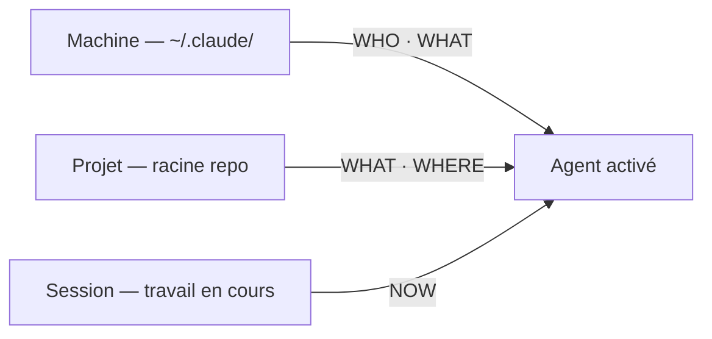
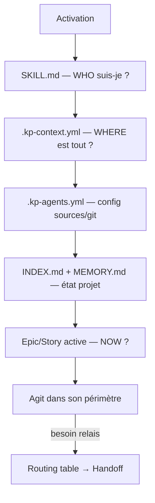

# Architecture du contexte agent

> Ce document répond à une question centrale : **que doit-on définir, où, pour qu'un agent IA constitue son contexte, appelle les bons agents et applique les bons principes du projet ?**
>
> Il s'appuie sur l'existant kp-agents, le challenge, et propose des évolutions concrètes — dont certaines radicales.

---

## Le problème fondamental

Un agent IA activé sur un projet doit répondre à **4 questions** avant d'agir :

| # | Question | Si mal répondu |
|---|----------|----------------|
| 1 | **Qui suis-je ?** — rôle, périmètre, contraintes | L'agent sur-génère, sort de son scope, contredit un autre agent |
| 2 | **Quel est ce projet ?** — stack, conventions, principes | L'agent invente des solutions incompatibles avec le contexte technique |
| 3 | **Où est tout ?** — emplacements des docs, sources externes | L'agent lit les mauvais fichiers ou écrit au mauvais endroit |
| 4 | **Que fait-on maintenant ?** — tâche courante, décisions récentes | L'agent ignore le travail en cours, repose des questions déjà traitées |

Ces 4 réponses doivent être **disponibles, structurées, et lisibles par un agent sans que l'utilisateur les répète à chaque session.**

---

## Les 3 couches de contexte

```
┌─────────────────────────────────────────────────────────────┐
│  COUCHE 1 — MACHINE   (~/.claude/)                          │
│  Préférences utilisateur, outils globaux, MCP, hooks        │
│  → Persiste toutes sessions, tous projets                   │
├─────────────────────────────────────────────────────────────┤
│  COUCHE 2 — PROJET    (racine du repo)                      │
│  Stack, conventions équipe, config sources, routing agents  │
│  → Commité, partagé avec toute l'équipe                     │
├─────────────────────────────────────────────────────────────┤
│  COUCHE 3 — SESSION   (travail en cours)                    │
│  Epic/story active, git diff, décisions de cette session    │
│  → Volatile, reconstituée à chaque activation               │
└─────────────────────────────────────────────────────────────┘
```

### Schéma de flux — constitution du contexte



---

## Table de référence — Quoi définir, où

| Information | Défini par | Emplacement | Surcharge possible |
|---|---|---|---|
| **Rôle, périmètre, anti-patterns** | Agent | `agents/<nom>.md` → généré dans `plugins/.../SKILL.md` | ❌ — intrinsèque à l'agent |
| **Stack technique** | Projet | `docs/architect.md` — référencé via `.kp-context.yml#stack` | ❌ — modifier via ADR |
| **Principes projet (non-tech)** | Projet | `CLAUDE.md` racine | ⚠️ — `~/.claude/CLAUDE.md` (machine) peut étendre |
| **Routing inter-agents** | Projet | `docs/agents.md` (routing table) — référencé via `.kp-context.yml#routing` | ❌ |
| **Conventions git** | Projet | `.kp-agents.yml` section `git:` | ✅ — `.kp-agents.local.yml` surcharge `project_key` |
| **Config sources (politique)** | Projet | `.kp-agents.yml` (`product`, `tickets`, `global_doc`) | ✅ — `.kp-agents.local.yml` surcharge champ par champ |
| **Chemins machine-spécifiques** | Machine | `.kp-agents.local.yml` (`product.path`, `global_doc.*`) | ❌ — par définition machine-local |
| **Carte de contexte projet** | Projet | `.kp-context.yml` | ❌ — modifier directement |
| **Index de la documentation** | Projet | `docs/INDEX.md` — maintenu par `documentation` | ❌ |
| **Mémoire projet** | Projet | `docs/MEMORY.md` — maintenu par `documentation` | ❌ — commité, partagé équipe |
| **Mémoire utilisateur** | Machine | `~/.claude/projects/…/MEMORY.md` | ❌ — per-user, non partagé |
| **Tâche courante** | Session | Epic/Story active + message utilisateur | ❌ — volatile, reconstituée à chaque activation |
| **Contexte cross-agents** | Session | Bloc handoff structuré (transmis en chat) | ❌ — volatile, produit par l'agent sortant |

---

## Ce qui fonctionne bien dans kp-agents

Avant de challenger, ce qui est **correctement exploité** :

**1. Le système d'includes**
`{{include:sources-config}}` injecté dans chaque agent est une bonne pratique DRY. Chaque agent hérite du protocole de chargement de sources sans le réécrire. À étendre.

**2. La séparation `.kp-agents.yml` / `.kp-agents.local.yml`**
Politique partagée (commité) vs chemins machine (gitignoré). Pattern solide, universel, à répliquer pour d'autres dimensions.

**3. Le bloc de handoff structuré**
`includes/handoff.md` définit un format de relais inter-agents. Chaque agent sait quoi transmettre. Évite la perte de contexte entre agents.

**4. `docs/INDEX.md` comme point d'entrée**
Un seul fichier pour cartographier toute la documentation. Chaque agent commence par le lire. Efficace et économe en tokens.

**5. La spécialisation par workflow**
8 agents distincts couvrent la chaîne complète : exploration → spec → architecture → implémentation → review → documentation. Chaque agent a un périmètre strict avec des anti-patterns explicites.

---

## Ce qui manque ou dysfonctionne

### Problème 1 — Pas de context map

Chaque agent hardcode ce qu'il doit lire : `docs/architect.md` pour la stack, `docs/INDEX.md` pour naviguer, etc. Si la structure change, il faut modifier tous les agents.

**Symptôme** : ajouter un fichier de référence projet (ex: `docs/conventions.md`) oblige à toucher chaque `agents/*.md` pour qu'ils le lisent.

### Problème 2 — Routing déclaratif non machine-readable

Le routing repose sur la `description` de chaque agent (texte libre) et les indications dans le corps du skill. L'utilisateur doit connaître l'existant ou lire la doc pour savoir quel agent appeler. Il n'existe pas de réponse automatique à "quel agent pour X ?"

**Symptôme** : après une review NO-GO, l'utilisateur doit se souvenir de taper `/kp-agents:developer`. L'agent `review` peut le suggérer, mais c'est du texte libre, pas une règle codifiée.

### Problème 3 — Mémoire projet absente

Les décisions prises en session (« on a choisi Prisma plutôt que Drizzle », « le module auth sera refactoré en v2 ») ne sont jamais persistées. La session suivante repart de zéro.

`~/.claude/projects/…/MEMORY.md` existe mais c'est de la mémoire **utilisateur**, pas **projet**. Elle ne voyage pas avec le repo, n'est pas partagée en équipe.

### Problème 4 — Principes projet non structurés

`CLAUDE.md` contient des règles mélangées : contraintes d'implémentation, règles git, conventions de nommage, règles de déploiement… Aucune hiérarchie. Un agent qui cherche « quel est le principe de gestion d'erreurs de ce projet » doit scanner tout le fichier.

### Problème 5 — Mélange persona / procédure dans les agents

Chaque `agents/<nom>.md` mélange :
- **Qui je suis** (rôle, ton, contraintes comportementales) — 10% du fichier
- **Comment je travaille** (processus, étapes, règles) — 40% du fichier
- **Protocoles partagés** (sources-config, handoff, docs-structure) — 50% du fichier via includes

Les 50% injectés via includes sont du boilerplate identique dans chaque agent. Ils gonflent chaque SKILL.md de ~600 lignes. Chaque agent porte l'intégralité du protocole sources-config — même s'il n'écrit jamais sur une source externe.

---

## Propositions d'amélioration

### Proposition 1 — `.kp-context.yml` : la context map

**Objectif** : fichier machine-readable à la racine du projet, lu par tous les agents au démarrage, qui indique où trouver quoi.

```yaml
# .kp-context.yml (commité — context map du projet)
context:
  stack:        docs/architect.md          # tech stack, ADR, patterns
  principles:   CLAUDE.md#principles       # règles non-techniques du projet
  routing:      docs/agents.md             # quel agent pour quoi
  current_work: docs/project/epics/        # epics/stories actives
  index:        docs/INDEX.md              # carte de la documentation
  conventions:
    git:        .kp-agents.yml#git         # conventions git
    naming:     CLAUDE.md#naming           # conventions de nommage
    errors:     docs/architect.md#errors   # gestion d'erreurs
```

**Impact** : chaque agent remplace ses hardcodes par une lecture de `.kp-context.yml`. Ajouter un fichier de référence = modifier uniquement la context map.

**Implémentation kp-agents** : créer `includes/context-map.md` (include obligatoire dans tous les agents) qui lit `.kp-context.yml` en premier si présent, sinon applique les defaults hardcodés actuels. Rétrocompatible.

---

### Proposition 2 — Routing table explicite

**Objectif** : section machine-readable dans `docs/agents.md` (ou `.kp-context.yml`) définissant les règles de routing.

```yaml
# Section routing dans .kp-context.yml ou docs/agents.md
routing:
  - signal: "idée|explorer|brainstorm|et si|et si on"
    agent: brainstorm
    anti: "idée déjà qualifiée avec des critères d'acceptation"

  - signal: "story|epic|roadmap|spec|user story|critères d'acceptation"
    agent: product
    anti: "implémentation de code"

  - signal: "implémente|code|développe|ajoute la feature|S-[0-9]+"
    agent: developer
    requires: [story_exists]
    anti: "rédiger une spec"

  - signal: "review|valide|vérifie|est-ce prêt|c'est bon"
    agent: review
    requires: [story_in_review_status]

  - signal: "architecture|ADR|choix technique|quelle lib|quel pattern"
    agent: architect
    anti: "implémentation, review de code existant"
```

**Impact** : tout agent peut répondre à "quel agent pour X ?" de manière cohérente. Le routing n'est plus du texte libre dans chaque skill — c'est une règle centralisée.

---

### Proposition 3 — `docs/MEMORY.md` : mémoire projet

**Objectif** : fichier commité, maintenu par l'agent `documentation`, qui capture les décisions prises en session et non déductibles des fichiers.

```markdown
# Mémoire projet

> Décisions et contexte persistants — maintenu par l'agent documentation.
> Complément aux ADR formelles (docs/architect.md) pour les décisions légères.

## Décisions techniques

- 2026-04-18 : Prisma retenu (vs Drizzle) pour le support OneDrive queries — voir ADR-003
- 2026-04-20 : Module auth prévu pour refactor en v2 (ticket non créé, mémo informel)

## Conventions établies en cours de projet

- Les stories d'une epic commencent toujours par la migration de schéma
- Les PR sont squash-mergées sur main (décision équipe, non écrite ailleurs)

## Points à surveiller

- La dépendance `@anthropic-ai/sdk` doit rester en peer dep (non bundle)
```

**Impact** : un agent activé en session N peut lire `docs/MEMORY.md` pour récupérer les décisions de sessions N-1, N-2… sans que l'utilisateur les répète. La mémoire voyage avec le repo.

**Différence avec ADR** : les ADR dans `docs/architect.md` sont formelles, structurées, avec contexte/conséquences/alternatives. `MEMORY.md` capture les décisions légères, informelles, « on a dit qu'on ferait X ».

---

### Proposition 4 (radicale) — Séparation persona / procédure

**Constat** : chaque `agents/<nom>.md` fait entre 300 et 600 lignes. La moitié est du boilerplate partagé. Les agents sont des monolithes.

**Proposition** : restructurer en deux niveaux.

```
agents/
├── personas/             ← QUI je suis (10-20 lignes max)
│   ├── developer.md
│   ├── architect.md
│   └── ...
├── procedures/           ← COMMENT je travaille (spécifique à chaque agent)
│   ├── developer.md
│   ├── architect.md
│   └── ...
└── shared/               ← PROTOCOLES partagés (aujourd'hui: includes/)
    ├── sources-config.md
    ├── handoff.md
    ├── routing.md        ← NOUVEAU: routing table
    └── context-map.md    ← NOUVEAU: lit .kp-context.yml
```

Le SKILL.md généré = `persona` + `procedure` + includes sélectifs (seulement ceux dont l'agent a besoin).

**Impact** :
- `sources-config` (27 Ko) n'est plus injecté dans les agents qui n'écrivent jamais sur source externe (brainstorm, ux-ui, documentation partielle)
- Modifier le protocole de relais = modifier `shared/handoff.md`, pas tous les agents
- Lire le périmètre d'un agent = lire 15 lignes, pas 500

**Coût** : refonte de `sync.sh` pour assembler persona + procedure + includes sélectifs. Effort estimé : 1 epic.

---

### Proposition 5 (radicale) — Skills atomiques vs agents orchestrateurs

**Constat** : la distinction `agent` / `skill` n'est pas exploitée. Chaque "agent" kp-agents est une skill Claude Code monolithique qui fait tout.

**Pattern alternatif** (inspiré des agents SDK Anthropic) :

```
agents/              ← Orchestrateurs (thin wrappers qui chargent contexte + routent)
skills/              ← Capacités atomiques réutilisables
  write-story/       ← écrire une story (utilisé par product)
  run-tests/         ← lancer les tests (utilisé par developer ET review)
  update-status/     ← mettre à jour le statut (utilisé par developer, review)
  generate-adr/      ← générer une ADR (utilisé par architect)
  update-index/      ← mettre à jour INDEX.md (utilisé par documentation)
```

Un agent = "qui je suis + quoi je charge + quels skills j'invoque".
Un skill = "une action précise, sans persona, réutilisable".

**Cas d'usage concret** : `run-tests` est aujourd'hui écrit deux fois — dans `developer.md` et dans `review.md`. Avec des skills atomiques, les deux agents l'importent.

**Limites** : Claude Code ne supporte pas nativement l'invocation de skills par des agents. Cette architecture est plus naturelle sur l'Anthropic Agent SDK. Pour kp-agents aujourd'hui, la valeur est dans la factorisation des procédures partagées, pas dans l'invocation runtime.

---

## Synthèse — Tableau de décision

| Proposition | Impact | Effort | Rétrocompat | Priorité |
|---|---|---|---|---|
| `.kp-context.yml` context map | Haut — tout agent bénéficie | Faible — nouveau fichier optionnel | ✅ Oui | **P1** |
| `docs/MEMORY.md` mémoire projet | Moyen — évite répétitions inter-sessions | Très faible — fichier markdown + procédure | ✅ Oui | **P1** |
| Routing table dans `docs/agents.md` | Moyen — routing plus prévisible | Faible — enrichir doc existante | ✅ Oui | **P2** |
| Séparation persona / procédure | Haut — agents 3× plus légers | Moyen — refonte sync.sh | ✅ Oui (génération identique) | **P2** |
| Skills atomiques | Haut long terme | Élevé — architecture nouvelle | ⚠️ Partielle | **P3** |

---

## Ce qu'un CLAUDE.md projet devrait contenir (structure recommandée)

Un `CLAUDE.md` non structuré force les agents à scanner tout le fichier pour extraire l'information pertinente. Structure recommandée :

```markdown
# CLAUDE.md — [Nom du projet]

## Identité du projet
[2-3 lignes : ce qu'est le projet, à qui il s'adresse]

## Stack
[Tech stack en liste courte — renvoi vers docs/architect.md pour le détail]

## Principes non-techniques
[Ex: "on préfère la clarté à la performance", "pas d'abstraction prématurée"]

## Conventions équipe
### Git
[Pattern de branche, messages de commit, squash vs merge]
### Nommage
[Conventions de fichiers, variables, fonctions]
### Gestion d'erreurs
[Pattern préféré : exception / Result type / error code]

## Agents et routing
[Renvoi vers docs/agents.md — quel agent pour quoi]

## Règles critiques
[Ce qu'aucun agent ne doit jamais faire : liste courte et précise]
```

---

## Schéma récapitulatif — Après propositions P1 + P2



---

## Références

- `.kp-agents.yml` — politique de sources (racine projet)
- `.kp-agents.local.yml` — chemins machine-spécifiques (gitignoré)
- `docs/agents.md` — workflow et routing inter-agents
- `docs/architect.md` — stack, ADR, décisions techniques
- `includes/sources-config.md` — protocole de chargement de sources (agents kp-agents)
- `includes/handoff.md` — format de relais inter-agents

---

*Document créé le 2026-05-01 — à faire évoluer avec les prochaines epics si les propositions P1/P2 sont retenues.*
