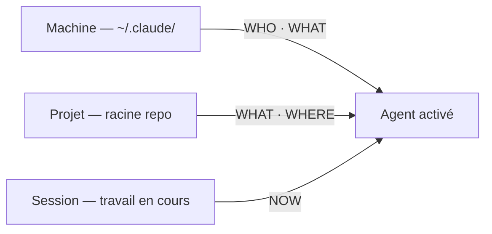
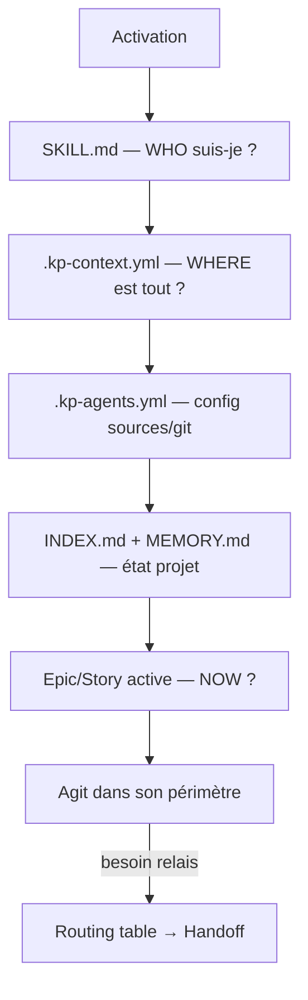

# Architecture du contexte agent

> Ce document répond à une question centrale : **que doit-on définir, où, pour qu'un agent IA constitue son contexte, appelle les bons agents et applique les bons principes du projet ?**

---

## Le problème fondamental

Un agent IA activé sur un projet doit répondre à **4 questions** avant d'agir :

| # | Question | Si mal répondu |
|---|----------|----------------|
| 1 | **Qui suis-je ?** — rôle, périmètre, contraintes | L'agent sur-génère, sort de son scope, contredit un autre agent |
| 2 | **Quel est ce projet ?** — stack, conventions, principes | L'agent invente des solutions incompatibles avec le contexte technique |
| 3 | **Où est tout ?** — emplacements des docs, sources externes | L'agent lit les mauvais fichiers ou écrit au mauvais endroit |
| 4 | **Que fait-on maintenant ?** — tâche courante, décisions récentes | L'agent ignore le travail en cours, repose des questions déjà traitées |

Ces 4 réponses doivent être **disponibles, structurées, et lisibles par un agent sans que l'utilisateur les répète à chaque session.**

---

## Les 3 couches de contexte

| Couche | Scope | Contenu | Persistance |
|---|---|---|---|
| 🖥️ **Machine** | `~/.claude/` | Préférences utilisateur, outils globaux, MCP, hooks | Toutes sessions, tous projets |
| 📁 **Projet** | Racine du repo | Stack, conventions équipe, config sources, routing agents | Commité, partagé avec l'équipe |
| ⚡ **Session** | Travail en cours | Epic/story active, git diff, décisions de la session | Volatile — reconstituée à chaque activation |

### Schéma de flux — constitution du contexte



---

## Table de référence — Quoi définir, où

| Information | Défini par | Emplacement | Surcharge possible |
|---|---|---|---|
| **Rôle, périmètre, anti-patterns** | Agent | `agents/<nom>.md` → généré dans `plugins/.../SKILL.md` | ❌ — intrinsèque à l'agent |
| **Stack technique** | Projet | `docs/architect.md` — référencé via `.kp-context.yml#stack` | ❌ — modifier via ADR |
| **Principes projet (non-tech)** | Projet | `CLAUDE.md` racine | ⚠️ — `~/.claude/CLAUDE.md` (machine) peut étendre |
| **Conventions git** | Projet | `.kp-agents.yml` section `git:` | ✅ — `.kp-agents.local.yml` surcharge champ par champ |
| **Sources des données docs** | Projet + Machine | Politique : `.kp-agents.yml` (`product`, `tickets`, `global_doc`) — Chemins : `.kp-agents.local.yml` (`product.path`, `global_doc.*`) | ✅ — `.kp-agents.local.yml` surcharge la politique champ par champ |
| **Index de la documentation** | Projet | `docs/INDEX.md` — maintenu par `documentation` | ❌ |
| **Mémoire projet** | Projet | `docs/MEMORY.md` — maintenu par `documentation` | ❌ — commité, partagé équipe |
| **Mémoire utilisateur** | Machine | `~/.claude/projects/…/MEMORY.md` | ❌ — per-user, non partagé |
| **Tâche courante** | Session | Epic/Story active + message utilisateur | ❌ — volatile, reconstituée à chaque activation |

---

## Ce qui fonctionne bien dans kp-agents

**1. Le système d'includes + refs (progressive disclosure)**
Protocoles partagés factorisés dans `includes/`. Les agents chargent `{{ref:sources-config}}` à la demande plutôt qu'en inline — coût zéro à l'activation, disponible quand l'agent en a besoin.

**2. La séparation `.kp-agents.yml` / `.kp-agents.local.yml`**
Politique partagée (commité) vs chemins machine (gitignoré). Pattern solide, universel, répliqué pour `global_doc`.

**3. Le bloc de handoff structuré**
`includes/handoff.md` définit un format de relais inter-agents. Évite la perte de contexte entre agents.

**4. `docs/INDEX.md` comme point d'entrée**
Un seul fichier pour cartographier toute la documentation. Chaque agent commence par le lire.

**5. La spécialisation par workflow**
8 agents couvrent la chaîne complète : exploration → spec → architecture → implémentation → review → documentation. Chaque agent a un périmètre strict avec des anti-patterns explicites.

---

## Ce qui a été implémenté

### Context map — `.kp-context.yml`

Fichier machine-readable à la racine, lu par tous les agents au démarrage via `{{include:context-map}}`. Déclare où trouver stack, index, routing, mémoire et principes. Si absent, chaque agent applique les chemins par défaut hardcodés — rétrocompatible.

```yaml
context:
  stack:        docs/architect.md
  index:        docs/INDEX.md
  routing:      docs/agents.md
  memory:       docs/MEMORY.md
  principles:   CLAUDE.md
  current_work: docs/project/epics/
```

### Mémoire projet — `docs/MEMORY.md`

Fichier commité maintenu par `documentation`. Capture les décisions informelles et contexte inter-sessions non déductibles des fichiers. Complément léger aux ADR formelles de `docs/architect.md`.

### Routing table — `docs/agents.md`

Section structurée (signal / agent / requires / anti) centralisée dans `docs/agents.md`. Remplace les indications de routing textuelles dispersées dans chaque skill.

### Séparation persona / procédure

- Marqueur `<!-- procedure-start -->` dans chaque `agents/<nom>.md` — sépare explicitement persona (rôle, ton) et procédure (comment travailler)
- `persona.md` (~900 octets) généré par skill dans `plugins/.../skills/<nom>/` — carte d'identité chargeable sans lire les 50 Ko de SKILL.md
- `sources-config-core.md` pour les 4 agents sans MCP/git — -48% de lignes chargées à l'activation (5 443 → 2 840 lignes total)

### Structure recommandée pour `CLAUDE.md` projet

Un `CLAUDE.md` non structuré force les agents à scanner tout le fichier. Structure recommandée :

```markdown
# CLAUDE.md — [Nom du projet]

## Identité du projet
## Stack
## Principes non-techniques
## Conventions équipe
### Git
### Nommage
### Gestion d'erreurs
## Règles critiques
```

---

## Non implémenté — Skills atomiques (P5)

**Constat** : chaque agent kp-agents est une skill Claude Code monolithique. Certaines procédures sont dupliquées (`run-tests` dans developer et review, `update-status` dans developer et review).

**Pourquoi pas implémenté** : Claude Code ne supporte pas l'invocation runtime de skills par des agents. L'architecture skills atomiques est naturelle sur l'Anthropic Agent SDK — pas sur le plugin marketplace actuel. La factorisation est aujourd'hui couverte par les `{{include:}}` partagés.

**Condition de réouverture** : si Claude Code expose une API d'invocation inter-skills, ou si le projet migre vers l'Agent SDK.

---

## Schéma récapitulatif — État actuel



---

## Références

- `.kp-context.yml` — carte de contexte projet (racine)
- `.kp-agents.yml` — politique de sources (racine)
- `.kp-agents.local.yml` — chemins machine-spécifiques (gitignoré)
- `docs/agents.md` — workflow et routing inter-agents
- `docs/MEMORY.md` — mémoire projet inter-sessions
- `docs/architect.md` — stack, ADR, décisions techniques
- `includes/sources-config-base.md` — protocole de chargement de sources (base)
- `includes/handoff.md` — format de relais inter-agents
