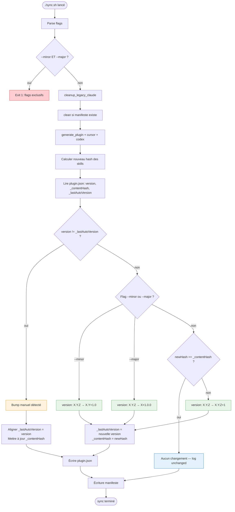

# Architecture — Auto-bump de version du plugin kp-agents

Document technique de référence pour l'implémentation de l'[epic E-0002](../../project/epics/E-0002-Auto-Bump-Version/readme.md). Sert de spec d'implémentation pour Developer et d'input à l'ADR-005 à intégrer dans [docs/architect.md](../../architect.md) lors de la story S-0003.

## Résumé technique

Le plugin `kp-agents` expose une version semver dans `plugins/kp-agents/.claude-plugin/plugin.json`. Cette version est la **seule** façon pour Claude Code de détecter une mise à jour côté client (comparaison du cache local vs remote). Pour supprimer le risque d'oubli, `sync.sh` calcule un hash SHA256 du contenu des skills générés et incrémente automatiquement le composant `patch` de la version si le hash a changé depuis le dernier sync. Les bumps `minor` et `major` restent pilotés manuellement par flags explicites, et les bumps manuels directs dans `plugin.json` sont respectés.

## Spike de faisabilité — point bloquant levé

**Avant toute implémentation**, le point bloquant R1 (champs custom rejetés par `claude plugin validate`) a été levé par un spike direct le 2026-04-18 :

```bash
# Ajout des champs _contentHash et _lastAutoVersion dans plugin.json
# puis validation
claude plugin validate /Users/vincent/GIT/kp-agents
# → ✔ Validation passed
```

**Conclusion** : les champs custom préfixés `_` sont acceptés par `claude plugin validate`. On peut donc stocker le hash et la version de référence **dans le même `plugin.json`**, sans fichier séparé. Ce choix est retenu pour la simplicité (centralisation, un seul diff lisible par commit).

## Objectifs et contraintes

### Objectifs
- Zéro oubli de bump : le contributeur n'a plus à penser à la version pour un changement de contenu
- Traçabilité : chaque bump est visible dans le diff `plugin.json` + reflet dans les logs `sync.sh`
- Réversibilité : un bump manuel explicite l'emporte toujours sur l'auto-bump

### Contraintes techniques
- Bash 3.2 compatible (pas de `mapfile`, pas d'associative array, pas de `wait -n`). Le projet existant respecte cette contrainte.
- Zéro nouvelle dépendance à installer : `shasum` et `openssl` sont standard macOS/Linux, `python3` est déjà utilisé implicitement (pour validation JSON dans les tests)
- Pas de `jq` : le projet n'en dépend pas aujourd'hui, on ne l'introduit pas pour garder l'installation 1-step sans pré-requis
- Le champ `version` dans `plugin.json` suit strictement `MAJOR.MINOR.PATCH` (semver partiel, pas de pré-release type `1.0.0-rc1` à ce stade)

### Contraintes non fonctionnelles
- Overhead de performance : < 200 ms sur les 7 skills actuels (le hash SHA256 est trivial sur ce volume)
- Idempotence : deux `./sync.sh` consécutifs sans modification laissent `plugin.json` strictement identique
- Pas d'action réseau ni d'I/O sortant : tout se calcule localement

## Architecture d'ensemble

### Nouveaux champs dans `plugin.json`

Trois champs manipulés par `sync.sh` :

| Champ | Type | Rôle |
|---|---|---|
| `version` | string semver | Version publique du plugin (lue par Claude Code client) |
| `_contentHash` | string (hexa 64 chars, préfixe `sha256:`) | Hash SHA256 du contenu des skills générés lors du dernier sync |
| `_lastAutoVersion` | string semver | Valeur de `version` au moment du dernier sync — sert à détecter les modifications manuelles |

Exemple d'état stable :
```json
{
  "name": "kp-agents",
  "version": "0.1.2",
  "description": "...",
  "author": {...},
  "homepage": "...",
  "repository": "...",
  "_contentHash": "sha256:7527cd29a83226bdb08a45e4c4758f8fdfd65159266cd22db245a36e8b1fd18b",
  "_lastAutoVersion": "0.1.2"
}
```

### Diagramme de flux



## Composants

### Fonction `compute_content_hash`

**Responsabilité** : calculer un hash SHA256 stable du contenu de tous les skills du plugin.

**Algorithme retenu** :

```bash
compute_content_hash() {
    # Hash chaque SKILL.md (output: hash + path) puis hash du tout
    # Le tri garantit un ordre stable indépendant du système de fichiers
    ( cd "$PLUGIN_DIR" && \
      /usr/bin/find skills -type f -name SKILL.md | sort | \
      xargs shasum -a 256 | shasum -a 256 | awk '{print $1}' )
}
```

**Notes** :
- On utilise le chemin absolu `/usr/bin/find` pour éviter les interceptions par des wrappers (ex: `rtk find`)
- Le `cd` dans un subshell isole la commande — le cwd du script reste inchangé
- Les chemins relatifs à `$PLUGIN_DIR/skills` sont inclus dans le hash, donc renommer un fichier change bien le hash (comportement voulu)
- Sortie : hash hexadécimal de 64 caractères

**Fallback openssl** (si `shasum` est absent — peu probable mais possible sur certaines images Docker minimalistes) :

```bash
compute_content_hash() {
    if command -v shasum >/dev/null 2>&1; then
        ( cd "$PLUGIN_DIR" && /usr/bin/find skills -type f -name SKILL.md | sort | xargs shasum -a 256 | shasum -a 256 | awk '{print $1}' )
    elif command -v openssl >/dev/null 2>&1; then
        ( cd "$PLUGIN_DIR" && /usr/bin/find skills -type f -name SKILL.md | sort | xargs -I{} sh -c 'echo "$(openssl dgst -sha256 "{}" | awk "{print \$NF}") {}"' | openssl dgst -sha256 | awk '{print $NF}' )
    else
        warn "No SHA256 tool available (tried shasum, openssl) — auto-bump skipped"
        echo ""  # hash vide = signal "skip"
    fi
}
```

### Fonction `read_plugin_json_field`

**Responsabilité** : extraire un champ du fichier JSON sans introduire de dépendance `jq`.

**Stratégie** : utiliser `python3` (déjà présent dans l'environnement dev du projet — utilisé par les validateurs JSON qu'on a lancés plus tôt).

```bash
read_plugin_json_field() {
    local field="$1"
    python3 -c "import json,sys; d=json.load(open('$PLUGIN_JSON')); print(d.get('$field',''))"
}
```

Pourquoi `python3` et pas `sed/awk` ? Parce que `plugin.json` peut être formaté sur plusieurs lignes, l'indentation peut varier selon l'éditeur, et `sed/awk` deviendrait fragile au moindre reformatage. `python3` garantit un parsing correct. Python 3 est standard sur macOS récent et Linux.

**Alternative si `python3` indisponible** : un fallback `node -e` ou `perl` — mais tous les envs testés ont `python3`. On documente ça comme pré-requis dans README troubleshooting (S-0003).

### Fonction `update_plugin_json`

**Responsabilité** : mettre à jour `version`, `_contentHash`, `_lastAutoVersion` dans `plugin.json` en préservant l'ordre et l'indentation des autres champs.

```bash
update_plugin_json() {
    local new_version="$1" new_hash="$2" new_last_auto="$3"
    python3 - "$PLUGIN_JSON" <<PYEOF
import json, sys
path = sys.argv[1]
with open(path) as f:
    d = json.load(f)
d['version'] = '$new_version'
d['_contentHash'] = '$new_hash'
d['_lastAutoVersion'] = '$new_last_auto'
with open(path, 'w') as f:
    json.dump(d, f, indent=2)
    f.write('\n')
PYEOF
}
```

Notes :
- `json.dump(..., indent=2)` préserve une indentation cohérente avec l'existant
- L'ajout d'un `\n` final est une convention Unix appliquée de façon cohérente dans le projet
- L'ordre des clés dans le JSON résultant suit l'ordre d'insertion Python (3.7+) — les champs custom `_*` apparaîtront en dernier si non présents initialement, ce qui est visuellement correct

### Fonction `bump_version`

**Responsabilité** : incrémenter un composant semver.

```bash
bump_version() {
    local current="$1" kind="$2"  # kind: major|minor|patch
    # Validation stricte du format
    if ! [[ "$current" =~ ^([0-9]+)\.([0-9]+)\.([0-9]+)$ ]]; then
        err "Invalid version format in plugin.json: \"$current\" (expected X.Y.Z)"
        return 1
    fi
    local major="${BASH_REMATCH[1]}" minor="${BASH_REMATCH[2]}" patch="${BASH_REMATCH[3]}"
    case "$kind" in
        major) echo "$((major + 1)).0.0" ;;
        minor) echo "$major.$((minor + 1)).0" ;;
        patch) echo "$major.$minor.$((patch + 1))" ;;
        *) err "Invalid bump kind: $kind"; return 1 ;;
    esac
}
```

### Fonction `apply_version_logic` (orchestration)

Point d'entrée de l'auto-bump. Appelée après `generate_plugin/cursor/codex`.

```bash
apply_version_logic() {
    local current_version current_hash last_auto new_hash
    current_version=$(read_plugin_json_field version)
    current_hash=$(read_plugin_json_field _contentHash)
    last_auto=$(read_plugin_json_field _lastAutoVersion)
    new_hash="sha256:$(compute_content_hash)"

    # 0. Cas fallback sans outil de hash
    if [[ "$new_hash" == "sha256:" ]]; then
        warn "Hash calculation skipped (no tool available) — version unchanged: $current_version"
        return 0
    fi

    # 1. Initialisation au premier run (champs absents)
    if [[ -z "$current_hash" || -z "$last_auto" ]]; then
        update_plugin_json "$current_version" "$new_hash" "$current_version"
        log "Plugin content hash initialized: sha256:${new_hash:7:12}... (version unchanged: $current_version)"
        return 0
    fi

    # 2. Bump manuel détecté : version a changé sans passer par ce script
    if [[ "$current_version" != "$last_auto" ]]; then
        update_plugin_json "$current_version" "$new_hash" "$current_version"
        log "Manual version bump detected ($last_auto → $current_version) — kept as-is, references updated"
        return 0
    fi

    # 3. Flag --minor ou --major explicite
    if $BUMP_MINOR; then
        local bumped; bumped=$(bump_version "$current_version" minor) || return 1
        update_plugin_json "$bumped" "$new_hash" "$bumped"
        ok "Plugin version bumped: $current_version → $bumped (minor, requested)"
        return 0
    fi
    if $BUMP_MAJOR; then
        local bumped; bumped=$(bump_version "$current_version" major) || return 1
        update_plugin_json "$bumped" "$new_hash" "$bumped"
        ok "Plugin version bumped: $current_version → $bumped (major, requested)"
        return 0
    fi

    # 4. Auto-bump patch si hash modifié
    if [[ "$current_hash" != "$new_hash" ]]; then
        local bumped; bumped=$(bump_version "$current_version" patch) || return 1
        update_plugin_json "$bumped" "$new_hash" "$bumped"
        ok "Plugin version bumped: $current_version → $bumped (content changed)"
        return 0
    fi

    # 5. Idempotence : rien n'a changé
    log "Plugin version unchanged: $current_version (no content change)"
}
```

### Parsing des flags dans `parse_args`

Ajout dans la boucle existante :

```bash
--minor)
    BUMP_MINOR=true
    ;;
--major)
    BUMP_MAJOR=true
    ;;
```

Validation de l'exclusivité **après** la boucle `parse_args` :

```bash
if $BUMP_MINOR && $BUMP_MAJOR; then
    err "--minor and --major are mutually exclusive, choose only one"
    exit 1
fi
```

Validation de compatibilité avec les autres flags :

```bash
if ($BUMP_MINOR || $BUMP_MAJOR) && $CLEAN_ONLY; then
    err "--minor / --major cannot be combined with --clean / --clean-all"
    exit 1
fi
```

`--dist-only` est compatible avec `--minor/--major` (le bump s'applique quand même au fichier généré, juste pas d'install locale Cursor/Codex).

## Ordre d'exécution dans `sync.sh` (`main()`)

```
1. parse_args                           [nouveau : validate --minor/--major exclusifs]
2. cleanup_legacy_claude                [inchangé]
3. mkdir des cibles                     [inchangé]
4. clean() (depuis manifeste)           [inchangé]
5. if CLEAN_ONLY: return                [inchangé]
6. Boucle : generate_plugin + cursor + codex par agent   [inchangé]
7. apply_version_logic                  [NOUVEAU — S-0001 puis étendu S-0002]
8. Écriture du nouveau manifeste        [inchangé]
9. Messages finaux                      [inchangé, adapté pour mentionner la nouvelle version le cas échéant]
```

## Données et contrats

### Contrat du champ `_contentHash`

- **Format** : `sha256:<hex64>` (préfixe explicite du hashing algorithm pour extensibilité future)
- **Scope** : calculé uniquement sur `plugins/kp-agents/skills/**/SKILL.md` (pas `plugin.json`, pas `marketplace.json`, pas Cursor/Codex)
- **Ordre stable** : `find | sort` garantit l'ordre alphabétique indépendant du filesystem

### Contrat du champ `_lastAutoVersion`

- **Format** : même format que `version` (semver X.Y.Z)
- **Sémantique** : dernière valeur de `version` connue par `sync.sh`. Si `version` diffère de `_lastAutoVersion` au run suivant, le script déduit qu'un humain a modifié `version` manuellement entre les deux et respecte ce choix.

### Contrat des flags CLI

| Flag | Description | Compatibilité |
|---|---|---|
| `--minor` | Bump explicite du mineur (patch remis à 0) | Incompatible avec `--major`, `--clean`, `--clean-all` |
| `--major` | Bump explicite du majeur (mineur et patch remis à 0) | Incompatible avec `--minor`, `--clean`, `--clean-all` |
| `--minor` + `--dist-only` | Bump effectué, pas d'install locale | OK |
| `--major` + `--dist-only` | Idem | OK |

### Contrat des logs

5 cas distincts, utilisant les helpers `log`/`ok`/`warn` existants :

| Cas | Helper | Message |
|---|---|---|
| Initialisation (premier run) | `log` | `Plugin content hash initialized: sha256:XXXXXXXXXXXX... (version unchanged: X.Y.Z)` |
| Bump patch auto | `ok` | `Plugin version bumped: X.Y.Z → X.Y.(Z+1) (content changed)` |
| Bump minor demandé | `ok` | `Plugin version bumped: X.Y.Z → X.(Y+1).0 (minor, requested)` |
| Bump major demandé | `ok` | `Plugin version bumped: X.Y.Z → (X+1).0.0 (major, requested)` |
| Bump manuel respecté | `log` | `Manual version bump detected (X.Y.Z → X.Y.W) — kept as-is, references updated` |
| Idempotence (aucun changement) | `log` | `Plugin version unchanged: X.Y.Z (no content change)` |
| Fallback sans outil hash | `warn` | `Hash calculation skipped (no tool available) — version unchanged: X.Y.Z` |

## Décisions techniques (à intégrer comme ADR-005 lors de S-0003)

### Draft ADR-005 — Auto-bump de version du plugin kp-agents

**Statut** : proposed (finalisé lors de S-0003)

**Contexte** :
Claude Code côté client détecte les mises à jour d'un plugin en comparant la `version` dans `plugin.json`. Si le contributeur oublie de bumper après une modification de contenu, aucun client ne reçoit la mise à jour. L'epic E-0001 a subi ce problème concrètement (symptôme `0 skills` résolu par renommage + bump forcé). Volume : 7 skills à hasher, durée d'exécution négligeable. Pas d'infrastructure CI/CD au projet (repo privé GitHub + mirror GitLab, pas de GitHub Actions actif).

**Décision** :
1. `sync.sh` calcule un hash SHA256 du contenu des `plugins/kp-agents/skills/**/SKILL.md` à la fin de chaque exécution (via `shasum -a 256`, fallback `openssl dgst -sha256`)
2. Ce hash est stocké dans un champ custom `_contentHash` de `plugin.json`. Un spike a confirmé que `claude plugin validate` accepte les champs custom préfixés `_`
3. Un second champ `_lastAutoVersion` stocke la version au moment du dernier sync, ce qui permet de détecter les modifications manuelles de `version` par le contributeur et de les respecter
4. Si le hash a changé, le script incrémente automatiquement le composant `patch` de la version
5. Deux flags explicites `--minor` et `--major` permettent de forcer un bump de niveau supérieur quand c'est sémantiquement requis (ajout/retrait d'agent, rupture de compatibilité). Ces flags sont mutuellement exclusifs.
6. La manipulation de `plugin.json` se fait via `python3` (déjà présent dans l'environnement dev, plus robuste que `sed/awk` sur un JSON formaté).

**Conséquences positives** :
- Zéro risque d'oubli de bump sur une modification de contenu
- Traçabilité : chaque bump est visible dans le diff git de `plugin.json`
- Réversibilité : un bump manuel explicite est toujours respecté par l'auto-bump
- Overhead négligeable (< 200 ms sur 7 skills)

**Conséquences négatives / points d'attention** :
- Deux nouveaux champs `_contentHash` et `_lastAutoVersion` apparaissent dans le `plugin.json` committé (cosmétique, mais visible aux lecteurs externes)
- Dépendance implicite à `python3` pour la manipulation JSON (acceptable : standard sur macOS/Linux, documentable dans le README)
- Un merge Git concurrent sur `plugin.json` peut produire une incohérence `version` ↔ `_contentHash` qui nécessite arbitrage manuel

**Alternatives rejetées** :

- **Fichier séparé `.claude-plugin/.content-hash`** : aurait évité les champs custom dans `plugin.json`, mais ajoute un fichier supplémentaire à committer et à maintenir. Rejeté après validation que `claude plugin validate` accepte les champs custom.
- **Bump basé sur un timestamp** (`date +%s` ajouté à `version`) : produirait un bump à chaque sync même sans changement → inflation indésirable + violation semver.
- **Bump basé sur `git rev-count` ou hash du commit** : couple le plugin à l'historique git, donne une version différente pour une branche vs main sans raison fonctionnelle, faux positifs à chaque commit même sans toucher aux skills.
- **Auto-bump plus intelligent** (ex: "ajout d'un fichier dans `skills/` → bump mineur automatique") : ambigu sémantiquement (un renommage = retrait + ajout ?), risque de faux positifs. Laissé comme décision humaine via flags.
- **Dépendance à `jq`** : plus élégant qu'un script Python inline, mais ajoute une dépendance d'installation que les devs KeyProd n'ont pas forcément. `python3` est déjà là.

## Sécurité, performance et opérations

### Sécurité
- Aucune donnée sensible manipulée. `plugin.json` est committé en clair, tous les champs sont publics.
- Le hash SHA256 est cryptographiquement robuste pour la détection de collision accidentelle ou malicieuse. Pas de préoccupation de sécurité sur ce point.

### Performance
- 7 skills × quelques KB chacun = << 100 KB total à hasher
- `shasum -a 256` sur < 100 KB : mesurable en ms
- Total overhead estimé : < 200 ms (négligeable devant le temps total de `sync.sh` déjà ~200 ms)

### Observabilité
- Les logs `sync.sh` explicitent systématiquement le cas de figure (1 ligne parmi 6 possibles)
- Le diff git sur `plugin.json` permet de vérifier a posteriori les bumps (ligne `version` + ligne `_contentHash`)
- Pas de métriques ni d'alerting ajoutés (hors scope projet interne)

### Déploiement / rollback
- Déploiement : aucun — le plugin est distribué par le mécanisme marketplace déjà en place
- Rollback : un bump à l'envers est possible via `git revert` du commit qui a bumpé. Mais semver ne permet pas de "descendre" la version côté client — si un client a déjà reçu `0.2.0`, il ignorera `0.1.x` qui vient après. Le rollback effectif passe par un nouveau bump en avant avec le contenu corrigé.

## Dette, risques et points à valider

### Risques consolidés

| Risque | Probabilité | Impact | Mitigation |
|---|---|---|---|
| R1 ~~Champ custom rejeté par Claude Code~~ | ~~Moyenne~~ | ~~Élevé~~ | ✅ Spike du 2026-04-18 : champs `_contentHash` et `_lastAutoVersion` acceptés par `claude plugin validate` |
| R2 `shasum` absent sur certains environnements | Faible | Moyen | Fallback `openssl` implémenté, warning si aucun des deux. Acceptable : le sync continue sans bump |
| R3 Merge git concurrent sur `plugin.json` | Faible | Faible | Doc dans README troubleshooting (S-0003) : arbitrer manuellement, relancer sync |
| R4 Détection bump manuel imprécise (ex: version restaurée à la valeur précédente) | Faible | Faible | Comportement acceptable : le script met à jour `_lastAutoVersion`, pas d'action préjudiciable |
| R5 Corruption de `plugin.json` par Python (ex: encoding) | Très faible | Moyen | Tests manuels dans S-0001 : plusieurs syncs consécutifs, contrôle du diff |

### Points à valider lors de l'implémentation

- Confirmer en pratique sur une machine Linux "fresh" (en complément de macOS testé) que `shasum` et `python3` sont présents → test lors de la review S-0001 sur un container Docker par exemple
- Vérifier que l'ordre des clés dans `plugin.json` après écriture Python reste stable sur plusieurs runs (pas de changement cosmétique indésirable dans le diff)

## Réponse consolidée aux 10 questions ouvertes du handoff

| # | Question | Réponse / recommandation |
|---|----------|--------------------------|
| 1 | Algorithme exact de hash | `find skills -type f -name SKILL.md | sort | xargs shasum -a 256 | shasum -a 256` dans un subshell `(cd $PLUGIN_DIR && ...)`. Préfixer le résultat par `sha256:` |
| 2 | jq ou sed/awk pour JSON ? | Utiliser **python3** (déjà disponible, robuste sur JSON multi-lignes). jq non introduit. |
| 3 | Compatibilité shasum/openssl macOS + Linux | `shasum 6.02` présent macOS, `openssl 3.6.1` aussi. Fallback `openssl` codé. Warning non bloquant si aucun des deux. |
| 4 | Placement du code dans `sync.sh` | Nouvelle fonction `apply_version_logic` appelée après la boucle de génération, avant l'écriture du manifeste |
| 5 | Regex semver | `^[0-9]+\.[0-9]+\.[0-9]+$` suffit. Pas de pre-release à gérer à ce stade. |
| 6 | Flag `--no-bump` | **Non** à l'implémentation initiale. Si besoin émerge, à ajouter en backlog. |
| 7 | Ordre des opérations dans `main()` | Conforme à ce qu'indiquait le handoff (voir section "Ordre d'exécution") |
| 8 | Labels de log | 6 cas distincts documentés (voir "Contrat des logs"). Helpers `log`/`ok`/`warn` existants réutilisés. |
| 9 | Risques R1-R4 | R1 levé par spike. R2 mitigation par fallback. R3/R4 documentés en troubleshooting. R5 (nouveau) : contrôle diff lors de review S-0001. |
| 10 | Point bloquant champs custom | ✅ **Levé** : `claude plugin validate` retourne `✔ Validation passed` avec `_contentHash` + `_lastAutoVersion` présents |

## Plan de validation technique

### Checklist pour S-0001 (implementation)

- [ ] Le premier run de `./sync.sh` après introduction du code ajoute `_contentHash` et `_lastAutoVersion` dans `plugin.json` sans bumper la version
- [ ] Le second run de `./sync.sh` sans modification laisse `plugin.json` strictement identique (idempotence bit-à-bit)
- [ ] Une modification dans `agents/brainstorm.md` suivie de `./sync.sh` bumpe la version patch et met à jour le hash
- [ ] `claude plugin validate` reste `✔ Validation passed` dans tous les cas
- [ ] Log clair dans chaque cas de figure (`unchanged`, `content changed`, `initialized`)

### Checklist pour S-0002 (flags)

- [ ] `./sync.sh --minor` bumpe le mineur et remet le patch à 0
- [ ] `./sync.sh --major` bumpe le majeur et remet mineur et patch à 0
- [ ] `./sync.sh --minor --major` retourne une erreur claire et exit 1
- [ ] `./sync.sh --minor --clean` retourne une erreur claire
- [ ] Éditer `version` à la main puis `./sync.sh` sans flag : la version est respectée
- [ ] Éditer `version` à la main puis `./sync.sh` avec modif de skill : la version manuelle l'emporte, le hash est mis à jour

### Checklist pour S-0003 (doc)

- [ ] ADR-005 intégrée dans `docs/architect.md`
- [ ] Section Troubleshooting dans `README.md` couvrant : `shasum` absent, conflit merge sur `plugin.json`, rollback
- [ ] Entrée `CHANGELOG.md` préparée pour la prochaine release (probablement v0.2.0 car ajout de feature)
- [ ] `CLAUDE.md` mis à jour : section "Publier une mise à jour" retire l'étape "bumper manuellement" (devient automatique, ou `--minor/--major` si rupture)

## Références

- [Epic E-0002](../../project/epics/E-0002-Auto-Bump-Version/readme.md)
- [S-0001 Auto-bump patch](../../project/epics/E-0002-Auto-Bump-Version/S-0001-Auto-Bump-Patch.md)
- [S-0002 Flags --minor/--major](../../project/epics/E-0002-Auto-Bump-Version/S-0002-Flags-Minor-Major.md)
- [S-0003 ADR-005 et doc](../../project/epics/E-0002-Auto-Bump-Version/S-0003-ADR-Documentation.md)
- [Architecture globale](../../architect.md) (ADR-001 à ADR-004 de E-0001)
- [sync.sh actuel](../../../sync.sh)
- Spike de validation : 2026-04-18 — champs custom validés par `claude plugin validate`
