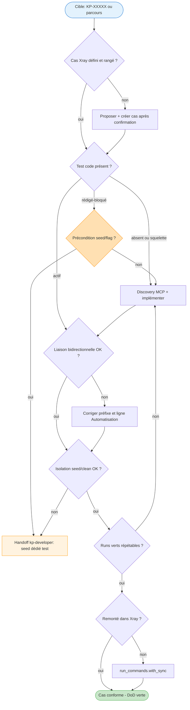

# Design technique — agent `kp-test`

> Refonte du dispositif E2E de `kp-agents` : **un agent unique `kp-test`** remplace le binôme obsolète `kp-xray` + `kp-e2e`. Garant de conformité de la chaîne E2E de bout en bout, piloté par une **Definition of Done à 6 critères**, project-agnostic via une nouvelle dimension de config `testing`.
>
> Idée source (qualifiée) : [../../ideas/e2e-orchestrator.md](../../ideas/e2e-orchestrator.md) — décisions D1-D6, spike de validation F1-F5 + FX1-FX4.
> ADR associées : [ADR-006](../../architect.md), [ADR-007](../../architect.md), [ADR-008](../../architect.md).

---

## 1. Contexte et objectif

Le socle E2E de keyprod (projet de référence) a basculé en juin 2026 vers **Pest 4 Browser** (`apps/kpweb/tests/Browser/`), avec liaison test ↔ cas par **préfixe `[KP-XXXXX]`** et remontée via `xray-sync.mjs`. Les deux agents actuels (`kp-xray`, `kp-e2e`) restent calés sur l'ancienne méthodo Playwright standalone (`devel/`, annotation `xray`, `sync-xray.js`) — obsolètes à ~80 %.

**Objectif** : un point d'entrée unique qui, pour un cas donné, **garantit que toute la chaîne est conforme** (cas Xray, test code, liaison, isolation seed/clean, validation, remontée) et **pilote la convergence** vers un test vert remonté.

**Garde-fous repo** : source de vérité = `agents/kp-test.md` ; jamais d'écriture dans `plugins/kp-agents/skills/` ni `dist/` (régénérés par `sync.sh`) ; rester agnostique (keyprod = référence d'implémentation, pas hardcode).

---

## 2. Persona et priorité

`kp-test` est le **garant de la chaîne E2E**, pas un générateur de tests. Sa priorité n°1 (décision utilisateur D3) : **garantir que tout est défini selon les règles attendues**. Un test n'est « fini » que lorsque les 6 critères de la Definition of Done sont verts. L'agent les audite, identifie le premier écart, le résout ou le délègue, et boucle.

---

## 3. Definition of Done (spec opposable)

La DoD est le **contrat central** de l'agent : elle est inscrite dans le `SKILL.md` et opposable en toute circonstance. Un cas `KP-XXXXX` est « fini » ⇔ les 6 critères sont satisfaits.

| # | Critère | Bloquant | Vérifié par | Délégation |
|---|---------|----------|-------------|------------|
| **1** | **Cas Xray défini ET rangé** — issue type `Test` existe, **rangée sous `root_folder`** (`/Tests PlayWright/…`), summary `Module > comportement`, description au gabarit (Persona / Écran / Préconditions / Étapes / Résultat / Automatisation / Cadre), label `case_label` | ✅ (rangement inclus — décision Q2) | `kp-test-case-design` | — (création après confirmation, cf. §7) |
| **2** | **Test code conforme** — fichier dans `tests_dir`, conventions respectées (`data-cy`, pas de `sleep`, strict mode, `assertNoJavaScriptErrors`), description FR métier | ✅ | `kp-test-implementation` | — |
| **3** | **Liaison bidirectionnelle** — préfixe `[KP-XXXXX]` exact dans le `it()` **ET** ligne `Automatisation : … <fichier>` de la description Xray pointant le bon fichier (finding FX2) | ✅ | `kp-test-implementation` | — |
| **4** | **Isolation seed + clean** — seed **dédié test** (jamais métier, D5), `beforeEach` + `ref` unique, cleanup idempotent `afterEach` | ✅ | `kp-test-data-isolation` | **Seed de domaine manquant → handoff `kp-developer`** |
| **5** | **Validation** — runs verts répétables (2-3×), zéro flake | ✅ | `kp-test-results-sync` | — |
| **6** | **Remontée effective** — `run_commands.with_sync` → Test Execution créée dans Xray | ✅ | `kp-test-results-sync` | — |

**Sous-critère non bloquant** : « cas lié à une story » (lien JIRA natif). Le référentiel actuel a `issuelinks: []` (finding FX3) → **warn configurable**, jamais bloquant.

**Mapping clé ↔ `it()` = 1:N** (finding FX4) : un cas peut être couvert par plusieurs `it()` ; la couverture s'évalue en **agrégeant** (statut maximal `FAILED > PASSED > TODO`, comme `xray-sync.mjs`).

---

## 4. Architecture de l'agent — orchestrateur + refs

Pattern « orchestrateur + refs procédurales » éprouvé sur `kp-setup` (cf. CLAUDE.md). Le `SKILL.md` reste un routeur léger ; les procédures lourdes vivent en refs chargées à la demande (progressive disclosure côté Claude ; inline côté Cursor/Codex via `sync.sh`).

```
agents/kp-test.md                      ← SOURCE (orchestrateur, ≤ 250 lignes)
  → plugins/kp-agents/skills/kp-test/
      ├── SKILL.md                      Persona + DoD + lecture config + router + anti-patterns
      ├── persona.md                    Carte d'identité (auto-générée)
      └── references/
          ├── kp-test-state-detection.md     Audit DoD : situer où on en est (4 états + runtime + BLOCKER)
          ├── kp-test-case-design.md         Critère 1 — concevoir/créer/ranger le cas (MCP + GraphQL Xray)
          ├── kp-test-implementation.md      Critères 2+3 — discovery MCP local, conventions, liaison bidirectionnelle
          ├── kp-test-data-isolation.md      Critère 4 — seed/clean dédié test + frontière kp-developer
          ├── kp-test-results-sync.md        Critères 5+6 — runs, validation, remontée Xray, protocole rouge/flake
          └── kp-test-coverage-audit.md      Vue inter-cas — orphelins (cas sans test / test sans cas), trous
```

**Sources des refs** : `includes/kp-test-<mode>.md` (copiées vers `references/` par `sync.sh`, comme les `setup-*.md`).

Le `SKILL.md` contient : persona + DoD (§3) + routine de lecture config (§6) + **routine d'orientation** (détection d'état d'abord, §8) + router de modes (§9) + anti-patterns transverses (jamais d'écriture dans le code applicatif `apps/<app>/` hors `tests_dir`, jamais de modif `data-cy` côté app, jamais d'écriture dans `database/seeds/`).

---

## 5. Décisions structurantes (résumé ADR)

| ADR | Décision | Statut |
|-----|----------|--------|
| **ADR-006** | Agent unique `kp-test` (orchestrateur + 6 refs, DoD à 6 critères) remplace `kp-xray` + `kp-e2e` | accepted |
| **ADR-007** | Dimension de config `testing` dans `docs/testing.md` + `docs/testing.local.md` (système frontmatter v2.0.0), 7ᵉ dimension de `kp-setup` | accepted |
| **ADR-008** | Double canal référentiel : MCP Atlassian (contenu/audit) + API GraphQL Xray (rangement folder, bloquant) — `kp-test` pilote l'API GraphQL directement via `.env.testing` | accepted |

---

## 6. Modèle de configuration — dimension `testing`

**Correction vs brainstorm** : la config ne vit **pas** dans `.kp-agents.yml` (obsolète depuis v2.0.0) mais dans le système de frontmatter `docs/*.md` (décision Q1, cf. ADR-007).

### `docs/testing.md` (commité — politique partagée équipe)

```markdown
---
kp-agents:
  testing:
    framework: pest-browser            # SEUL supporté. playwright = hook futur. cypress = déprécié
    tests_dir: apps/kpweb/tests/Browser
    test_file_pattern: "*Test.php"
    run_commands:
      headless:  "make test-browser"
      with_sync: "make test-browser-xray"
      up:        "make test-browser-up"
      down:      "make test-browser-down"
    case_repository:
      type: xray
      mcp_server: <hérite de tickets.mcp_server si défini>
      project_key: KP
      root_folder: "/Tests PlayWright"
      test_link_pattern: "\\[KP-\\d+\\]"     # regex de liaison (machine)
      test_link_format: "[KP-{id}]"          # gabarit de préfixe injecté dans le it()
      case_label: pest-browser               # label de convention réel (finding FX4)
      graphql_endpoint: "https://xray.cloud.getxray.app/api/v2"
    isolation:
      test_seed_namespace: "Database\\Seeders\\Browser"   # seeds DÉDIÉS test — jamais métier (D5)
      baseline_seeder: BrowserTestSeeder
      unique_ref_strategy: "ref = 'e2e-' . uniqid()"
    conventions_doc: apps/kpweb/docs/e2e/conventions.md
---

# Stratégie de test E2E du projet
<prose humaine>
```

### `docs/testing.local.md` (gitignored — machine-spécifique)

```markdown
---
kp-agents:
  testing:
    discovery:
      mcp: playwright
      base_url_local: "http://localhost:8081"   # app rend en EN local vs FR remote
    case_repository:
      credentials_env: apps/kpweb/.env.testing  # XRAY_CLIENT_ID / XRAY_CLIENT_SECRET (déjà utilisés par xray-sync.mjs)
---
```

**Répartition** : commité = ce qui est partagé (framework, dirs, commands, structure du référentiel, isolation, conventions). Local = ce qui dépend de la machine (URL/port de découverte, chemin du fichier de credentials).

**Lecture au démarrage** (protocole `sources-config-base.md`) : `kp-test` lit le frontmatter `kp-agents.testing` de `docs/testing.md` puis applique l'override `docs/testing.local.md` (deep merge). Absence de config → warn + redirection `kp-setup` + mode dégradé (l'agent demande les infos minimales en conversation).

---

## 7. Double canal vers le référentiel de cas (ADR-008)

`kp-test` opère sur **deux canaux complémentaires** :

| Besoin | Canal | Outils |
|--------|-------|--------|
| **Lire / auditer** le contenu d'un cas (summary, description, type, labels, liens) | **MCP Atlassian standard** | `getJiraIssue`, `searchJiraIssuesUsingJql` |
| **Vérifier le rangement** dans `root_folder` (folder Xray invisible au MCP) | **API GraphQL Xray** | `getFolder` / `getTests` |
| **Créer + ranger** un cas (atomique) | **API GraphQL Xray** | `authenticate` → `createTest(testType: Manual, folderPath, jira)` |

**Pourquoi deux canaux** : le finding FX1 montre que les **steps sont en prose markdown dans la description** (pas en Xray Manual Steps natifs) → le MCP standard suffit pour lire/auditer le contenu. Mais le **folder Xray** (`/Tests PlayWright`) est une notion Xray non exposée par le MCP → l'API GraphQL est requise pour le rangement, rendu **bloquant** par décision Q2.

**Pilotage GraphQL** : le helper historique (`devel/playwright/scripts/xray-duplicate-cypress.js`) est **archivé/déprécié** — il n'existe pas dans le socle courant. `kp-test` **pilote l'API GraphQL directement** (script Node ad-hoc : `authenticate` avec `client_id`/`secret` lus depuis `credentials_env`, puis `createTest`/`getFolder`). Les credentials `XRAY_CLIENT_ID`/`XRAY_CLIENT_SECRET` existent déjà dans `apps/kpweb/.env.testing` (réutilisés depuis `xray-sync.mjs`).

**Gotcha Xray** (hérité de l'ancien kp-xray, à reconduire) : le champ `data` des steps est désactivé côté KP → ne jamais l'envoyer. Création non idempotente → vérifier l'existant (`searchJiraIssuesUsingJql` sur summary) avant `createTest`.

**Prérequis & mode dégradé** : si `credentials_env` absent / API GraphQL injoignable → critère 1 **non satisfiable** → l'agent **bloque sur ce critère** (comme l'ancien kp-xray), signale le prérequis, et propose `kp-setup` ou la création des credentials. Il **ne déclare jamais un cas DONE sans rangement vérifié**.

**Création = après confirmation (décision Q3)** : quand un cas manque, `kp-test` **propose** summary + description (au gabarit) + folder cible, et n'appelle `createTest` **qu'après validation explicite**. Jamais de création JIRA silencieuse.

---

## 8. Protocole de détection d'état (cœur de l'orchestration)

Matérialise « où on en est ». Validé par le spike (F1/F2). Pour une cible (clé `KP-XXXXX` ou parcours) :

### Lectures (ordre)
1. **Story / contexte** fourni par l'utilisateur.
2. **Filesystem** : `grep -roE "<test_link_pattern>" <tests_dir>` → localise le(s) `it()` portant la clé.
3. **Cas Xray** : MCP `getJiraIssue` (contenu) + GraphQL `getFolder` (rangement).
4. **Runtime** (si demandé) : dernier run / Test Execution.

### 4 états filesystem + statut runtime (finding F2)

| État | Signature | Critère DoD en écart | Prochain pas |
|------|-----------|----------------------|--------------|
| **Absent** | aucun `it()` pour la clé | 1, 2, 3 | créer cas (§7) puis implémenter |
| **Squelette** | `it("[KP-X] …")->todo();` sans corps | 2 | discovery MCP + implémenter |
| **Rédigé-bloqué** | corps `function` complet + `->todo()` + commentaire `BLOCKER:` | 4 (le plus souvent) | **parser le `BLOCKER:` → handoff `kp-developer`** (précondition/seed) |
| **Actif** | `it("[KP-X] …", function(){…})` | 5, 6 | valider (run) + remonter |

+ **statut runtime** (vert / rouge / flake), orthogonal.

**Parsing `BLOCKER:`** (clé du spike F3) : les commentaires `BLOCKER:` encodent *pourquoi* un test n'est pas actif et pointent quasi-toujours une précondition de seed/flag → l'agent les extrait et **route vers `kp-developer`** avec la précondition explicite.

### Arbre de décision (simplifié)



---

## 9. Modes d'utilisation

| Mode | Usage |
|------|-------|
| **`auto`** (défaut) | Orchestration complète : détection d'état → convergence DoD → prochain pas |
| `design` | Forcer le critère 1 seul (concevoir/créer/ranger un cas Xray) |
| `implement` | Forcer critères 2+3 (implémenter le test code + liaison) |
| `sync` | Forcer critères 5+6 (run + remontée) |
| `audit` | Lecture seule — couverture inter-cas (`kp-test-coverage-audit`), aucun effet de bord |

`auto` est le geste nominal ; les modes forcés servent les reprises ciblées et l'audit.

---

## 10. Frontières inter-agents

| Frontière | Règle |
|-----------|-------|
| **`kp-developer`** (seeds) | Owner exclusif des seeds. `kp-test` **n'écrit jamais** dans `database/seeds/`. Sur besoin → **handoff explicite** : « créer un seeder **dédié test** pour `<domaine>` sous `isolation.test_seed_namespace`, ne pas toucher aux seeders métier ». **Invariant D5** : si `kp-test` détecte qu'un test dépend d'un seed **hors** `test_seed_namespace` (= seed métier détourné) → refus + handoff. |
| **`kp-product`** (stratégie) | Owner des axes de couverture et priorités (P0/P1/P2). `kp-test` exécute la couverture demandée ; handoff entrant possible (`kp-product` → « voici l'axe à couvrir »). Au quotidien : l'utilisateur cible un parcours / une clé. |
| **`kp-architect`** (bootstrap) | Owner du scaffolding harness (`tests/Browser/`, Makefile, `.env.testing`) sur un nouveau projet. |
| **app code** (`apps/<app>/`) | `kp-test` ne pose jamais de `data-cy` lui-même → **recommandation** à `kp-developer` (finding FX5, `kpweb-recommendations.md`). |

---

## 11. Stratégie de migration

### Remplacement
- **Créer** `agents/kp-test.md` + 6 `includes/kp-test-*.md`.
- **Retirer** `agents/kp-xray.md` et `agents/kp-e2e.md`. `sync.sh` purge chirurgicalement les skills/Cursor/Codex via `.installed-agents`. Pas de stub de redirection (utilisateur quasi-unique, ancien Xray purgé — inertie nulle).
- **Conserver** le contenu réutilisable : auth Xray GraphQL + gotcha `data` (de kp-xray) → `kp-test-case-design` ; sélecteurs robustes + juge LLM « le test teste-t-il la bonne chose » (de kp-e2e) → `kp-test-implementation`.

### Évolution `kp-setup`
- 7ᵉ dimension `testing` → nouvelle ref `includes/setup-testing.md` (modèle : `setup-git.md` / `setup-tickets.md`).
- Protocole de lecture → étendre `sources-config-base.md` (tableau des fichiers + ligne `docs/testing.md`).
- Heuristique de détection : présence de Pest (`vendor/bin/pest` + `tests/Browser/`) → propose `framework: pest-browser` + défauts.
- Section `CLAUDE.md` gérée : ajouter `## Tests E2E` (ou intégrer à une section existante).

### Documentation
- `docs/agents.md` : retirer kp-xray + kp-e2e, ajouter kp-test (vignette + diagramme du flux DoD), maj table de routing.
- `CLAUDE.md` repo : table des agents (retrait de 2, ajout de 1 → relais `kp-documentation`).
- `docs/architect.md` (kp-agents) parle encore de « 7 agents » — obsolète, à corriger par `kp-documentation`.
- `.kp-context.yml` pointe encore `.kp-agents.yml` (antérieur à v2.0.0) — incohérence à corriger par `kp-documentation`.

### Bump version (release)
- Retrait de 2 agents + ajout de 1 = **changement de surface des skills**. Recommandation : **`--minor`** (nouvelle capacité nette) avec mention CHANGELOG du retrait kp-xray/kp-e2e. `--major` justifiable si on considère le retrait comme une rupture pour d'éventuels utilisateurs des anciens noms. **Décision à la release** (cf. ADR-005 : auto-bump respecte un bump manuel).

---

## 12. Risques et mitigations

| Risque | Prob. | Impact | Mitigation |
|--------|-------|--------|------------|
| **R1 — Config `testing` absente** sur un nouveau projet | Moyenne | Élevé | Auto-redirect `kp-setup` + défauts pest-browser si Laravel/Pest détecté |
| **R2 — Credentials Xray / API GraphQL indispo** (critère 1 bloquant) | Élevée | Élevé | Mode dégradé : bloquer sur critère 1, signaler le prérequis, ne jamais déclarer DONE sans rangement vérifié. Réutiliser `apps/kpweb/.env.testing` |
| **R3 — Playwright MCP local indispo** (discovery) | Élevée | Moyen | Ébauche depuis story+conventions, `->todo()`, demande de démarrer MCP (finding F5) |
| **R4 — Détection d'état erronée** (doublon créé) | Moyenne | Élevé | `grep test_link_pattern` + MCP/GraphQL **avant** toute création ; confirmation avant `createTest` |
| **R5 — Seed métier détourné** | Confirmée (D5) | Élevé | Invariant dur : refus + handoff `kp-developer` si dépendance hors `test_seed_namespace` |
| **R6 — Agent volumineux** (SKILL + 6 refs) | Moyenne | Moyen | Progressive disclosure côté Claude ; surveiller la taille inline Cursor/Codex (scinder si >500 lignes générées) |
| **R7 — Désync `agents/` ↔ `plugins/`** | Élevée | Moyen | Lancer `sync.sh` avant commit (garde-fou existant ADR-002) |

---

## 13. Validation et preuves attendues

- **Spike déjà réalisé** (cf. idée, F1-F5 + FX1-FX4) : détection d'état filesystem validée, critère 1 vérifiable via MCP, double canal de liaison confirmé.
- **À valider après implémentation** : dérouler `kp-test` en `auto` sur 1-2 cas P0 keyprod réels — idéalement un cas **rédigé-bloqué** (KP-18190, Events) pour exercer le parsing `BLOCKER:` + handoff `kp-developer`, et un cas **actif** (Auth, KP-18179) pour exercer validation + remontée.
- **Validation agnostique** (plus tard) : poser un `docs/testing.md` adapté sur un projet tiers (hook `playwright`).

---

## 14. Handoff

> **Handoff → /kp-agents:kp-developer**
> **Depuis** : architect-agent
> **Contexte** : implémenter la refonte E2E — créer `agents/kp-test.md` + 6 refs, retirer kp-xray/kp-e2e, étendre kp-setup (dimension `testing`), mettre à jour la doc.
> **Acquis (design figé)** :
> - DoD à 6 critères (§3) = spec opposable, critère 1 inclut le **rangement folder bloquant** (Q2).
> - Structure orchestrateur + 6 refs `kp-test-*` (§4), sources `includes/kp-test-*.md`.
> - Config dimension `testing` → `docs/testing.md` + `docs/testing.local.md` (§6, ADR-007), **pas** `.kp-agents.yml`.
> - Double canal référentiel : MCP Atlassian (contenu) + GraphQL Xray piloté en direct (rangement, §7, ADR-008), credentials `apps/kpweb/.env.testing`.
> - Détection d'état : 4 états + runtime + parsing `BLOCKER:` (§8).
> - Création de cas = **après confirmation** (Q3) ; seeds = `kp-developer`, dédiés test (§10, D5).
> **À traiter (par developer, dans cet ordre)** :
> 1. `includes/kp-test-*.md` (6 refs) + `agents/kp-test.md` (orchestrateur ≤ 250 lignes).
> 2. `includes/setup-testing.md` + extension `sources-config-base.md` (ligne `docs/testing.md`) + maj `agents/kp-setup.md` (7ᵉ dimension).
> 3. Retrait `agents/kp-xray.md` + `agents/kp-e2e.md`, `./sync.sh`, vérif `git diff plugins/`, bump `--minor`.
> 4. Maj `docs/agents.md` + `CLAUDE.md` (relais `kp-documentation` pour l'index).
> **Fichiers de référence** :
> - Ce design + [../../ideas/e2e-orchestrator.md](../../ideas/e2e-orchestrator.md) + [../../architect.md](../../architect.md) (ADR-006/007/008)
> - Modèles : `agents/kp-setup.md`, `includes/setup-git.md`, `includes/sources-config-base.md`
> - Socle keyprod : `apps/kpweb/tests/Browser/`, `apps/kpweb/tests/Browser/scripts/xray-sync.mjs`, `apps/kpweb/Makefile`, `apps/kpweb/.env.testing`

---
